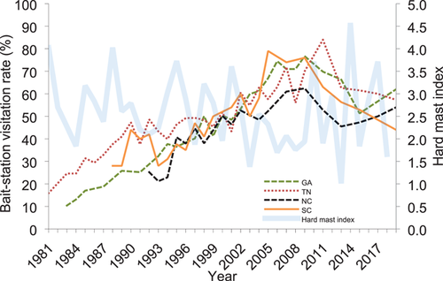

```{r setup, include = FALSE}
options(htmltools.dir.version = FALSE)
knitr::opts_chunk$set(echo = FALSE, fig.align = 'center', warning=FALSE, message=FALSE,fig.retina = 2)
library(WILD8370)
library(nimble)
library(MCMCvis)
source(here::here("R/zzz.R"))
# library(gganimate)
```

# Readings: 
<br/>
> Kéry & Schaub 115-131

<br/>

A good review paper:

> <https://esajournals.onlinelibrary.wiley.com/doi/10.1002/ecm.1470>

---

## Observation models

- Rarely observe the true state perfectly  

    + Animals are elusive and may hide from observers  
    + Even plants may be cryptic and hard to find  
    + Measurements may be taken with error  
    + May count the same individual > 1


--
- *Observation uncertainty* $\large (\sigma^2_o)$ can lead to biased estimates of model parameters, so generally requires its own model  
<br/>

$$\Huge [y_i|d(\Theta_o,z_i), \sigma^2_o]$$

---
class: inverse, middle, center

# State-space models

---
## State-space models

- Hierarchical models  

- Extremely common 

--
- Decompose time series into:  

    + process variation in state process  
    + observation error  

--
- Generally used for *Markovian* state process models  

    + Population dynamics  
    + Survival  
    + Occupancy  
    
---
## Example: Population dynamics

When counts are repeated and individuals unmarked, often referred to as 'N-mixture' models

### Process Model 
$$\Large N_{t+1} \sim Poisson(N_t \lambda)$$ 

### Observation Model 
$$\Large C_{t} \sim Binomial(N_t, p)$$  

Can easily switch out observation models 

$$\Large C_{t} \sim Normal(N_t, \sigma_o^2)$$  

---
## Example: Occupancy

### Process Model
$$\Large z_{t+1} \sim Bernoulli\bigg(z_t (1-\epsilon_t) + (1 - z_t)\gamma_t\bigg)$$  

### Observation

$$\Large y_{t} \sim Bernoulli\big(z_t p_t\big)$$ 


---
## Example: Individual Level Survival

### Process Model 

$$\Large z_{t+1} \sim Bernoulli\big(z_t \phi_t\big)$$ 


### Survival

$$\Large y_{t} \sim Bernoulli\big(z_t p\big)$$  
---
## Including covariates

#### For any of these models, we can use GLMs to include covariates effects on parameters:

$$\Large log(\lambda_t) = \alpha + \mathbf \beta \mathbf X + \varepsilon_t$$

$$\Large logit(\phi_t/\gamma_t/\epsilon_t/p_t) = \alpha + \mathbf \beta \mathbf X + \varepsilon_t$$

---
## State-space models

#### Produce unbiased estimates of $\Large N$ **only** when false-positives and false-negatives cancel each other out on average  
<br/>

--
#### Produce unbiased estimates of population **indices** $\Large (Np)$ if detection probability has no pattern over time  
<br/>

--
#### Do **not** produce unbiased estimates of $\Large N$ or $\Large Np$ if their are temporal patterns in detection probability or false-positive rates 

---
## Example: Population Growth Rate
```{r, eval =T, include = F}
pop_grow <- nimbleCode({
N[1] ~ dunif(0, 500)            # Prior for initial population size
sigma.obs ~ dexp(1)       # Prior for sd of observation process
b0 ~ dnorm(0, 1) #prior for beta0
b1 ~ dnorm(0, 1) #prior for beta1
# Likelihood
# State process
for (t in 1:(n.years-1)){
   log(lambda[t]) <- b0 + b1*X[t] #some covariate association
   N[t+1] <- N[t] * lambda[t] 
   }
# Observation process
for (t in 1:n.years) {
   y[t] ~ dnorm(N[t], sd = sigma.obs)
   }
})
```
```{r include=FALSE}
set.seed(61)
n.years <- 25           # Number of years
N1 <- 30                # Initial population size
b0 <- .03     
b1 <- -.1
sigma2.lambda <- 0.02   # Process (temporal) variation of the growth rate
sigma2.y <- 25          # Variance of the observation error
X <- runif(n.years)

y <- N <- lambda <- numeric(n.years)
N[1] <- N1
for (t in 2:n.years){
  lambda[t] <- exp(b0 + b1*X[t])
   N[t] <- N[t-1] * lambda[t]
   }

for (t in 1:n.years){
   y[t] <- rnorm(1, N[t], sqrt(sigma2.y))
   }
```

```{r, include = F}
consts <- list(n.years = 25, X = X)
dat <- list(y =y)
inits <- list(sigma.obs = rexp(1,1), b0 = b0, b1 = b1, N = c(N1, rep(NA, n.years-1)))
params <- c('N')
nimfit <- nimbleMCMC(code = pop_grow,
                     data = dat,
                     constants = consts,
                     inits = inits,
                     monitors = params,
                     thin = 1,
                     niter = 4000,
                     nburnin = 1000,
                     nchains = 3,
                     samplesAsCodaMCMC = TRUE
                      )
Goodmod <- summary(nimfit)$quantiles[1:25,]
df1 <- data.frame(Year = 1:n.years,True = N, Observed = y, 
                 Estimated = c(Goodmod[,3]), LCI = c(Goodmod[,1]), UCI = c(Goodmod[,5]))
```

```{r, echo = F, fig.width=7, fig.height=6}
ggplot() + 
  geom_line(data = df1, aes(x = Year, y = True)) +
   geom_point(data = df1, aes(x = Year, y = True), cex =4, fill = 'lightblue', pch = 22)+
   geom_line(data = df1, aes(x = Year, y = Observed), lty = 2) +
   geom_point(data = df1, aes(x = Year, y = Observed), cex =3, fill = 'firebrick', pch = 21)+
   scale_y_continuous("N")+
   theme_minimal()+
   ggtitle('True vs Observed')
```

---
## Example: Population Growth Rate
```{r, eval =F, include = T, echo = T}
pop_grow <- nimbleCode({
N[1] ~ dunif(0, 500)            # Prior for initial population size
sigma.obs ~ dexp(1)       # Prior for sd of observation process
b0 ~ dnorm(0, 1) #prior for beta0
b1 ~ dnorm(0, 1) #prior for beta1
# Likelihood
# State process
for (t in 1:(n.years-1)){
   log(lambda[t]) <- b0 + b1*X[t] #some covariate association
   N[t+1] <- N[t] * lambda[t] 
   }
# Observation process
for (t in 1:n.years) {
   y[t] ~ dnorm(N[t], sd = sigma.obs)
   }
})
```

---
## Example: Population Growth Rate
```{r, echo = F, fig.width=7, fig.height=6}
ggplot() + 
  geom_ribbon(data = df1, aes(x = Year, ymin = LCI, ymax = UCI), cex =3, fill = 'tan', pch = 21, alpha = .2)+
  geom_line(data = df1, aes(x = Year, y = True)) +
   geom_point(data = df1, aes(x = Year, y = True), cex =4, fill = 'lightblue', pch = 22)+
   geom_line(data = df1, aes(x = Year, y = Observed), lty = 2) +
   geom_point(data = df1, aes(x = Year, y = Observed), cex =3, fill = 'firebrick', pch = 21)+
  geom_line(data = df1, aes(x = Year, y = Estimated), col = 'tan') +
   scale_y_continuous("N")+
   theme_minimal()+
   ggtitle('True vs Observed vs Estimated')
```

---


## Example: Wrong Model

What if you get better at detection over time? Or there's no change in population? 

```{r include=FALSE}
n.years <- 25           # Number of years
y2 <- pp <- array(NA, n.years)
lp <- -0.75 + 0.2*(1:n.years)  # Increasing trend of logit p
pp <- plogis(lp)
N2 <- 40
for (t in 1:n.years){
   y2[t] <- rbinom(1, N2, pp[t])
}
```

```{r, include = F}
consts2 <- list(n.years = 25, X = X)
dat2 <- list(y =y2)
inits2 <- list(sigma.obs = rexp(1,1), b0 = b0, b1 = b1, N = c(N1, rep(NA, n.years-1)))
params <- c('N')
nimfit2 <- nimbleMCMC(code = pop_grow,
                     data = dat,
                     constants = consts,
                     inits = inits,
                     monitors = params,
                     thin = 1,
                     niter = 4000,
                     nburnin = 1000,
                     nchains = 3,
                     samplesAsCodaMCMC = TRUE
                      )
badmod <- summary(nimfit)$quantiles[1:25,]
df2 <- data.frame(Year = 1:n.years,True = N2, Observed = y2, 
                 Estimated = c(badmod[,3]), LCI = c(badmod[,1]), UCI = c(badmod[,5]))
```


```{r, echo = F, fig.width=7, fig.height=6}
ggplot() + 
  geom_line(data = df2, aes(x = Year, y = True)) +
   geom_point(data = df2, aes(x = Year, y = True), cex =4, fill = 'lightblue', pch = 22)+
   geom_line(data = df2, aes(x = Year, y = Observed), lty = 2) +
   geom_point(data = df2, aes(x = Year, y = Observed), cex =3, fill = 'firebrick', pch = 21)+
   scale_y_continuous("N")+
   theme_minimal()+
   ggtitle('True vs Observed')
```

---
## Example: Wrong Model

```{r, echo = F, fig.width=7, fig.height=6}
ggplot() + 
  geom_ribbon(data = df2, aes(x = Year, ymin = LCI, ymax = UCI), cex =3, fill = 'tan', pch = 21, alpha = .2)+
  geom_line(data = df2, aes(x = Year, y = True)) +
   geom_point(data = df2, aes(x = Year, y = True), cex =4, fill = 'lightblue', pch = 22)+
   geom_line(data = df2, aes(x = Year, y = Observed), lty = 2) +
   geom_point(data = df2, aes(x = Year, y = Observed), cex =3, fill = 'firebrick', pch = 21)+
  geom_line(data = df2, aes(x = Year, y = Estimated), col = 'tan') +
   scale_y_continuous("N")+
   theme_minimal()+
  
   ggtitle('True vs Observed vs Estimated')
```

---

## State-space models

#### Advantages  

- explicit decomposition of process and observation models  

- flexible  

- mechanistic "smoothing" of process model  

- latent state (and uncertainty) can be monitored  

- possible to "integrate" data on state/observation parameters


#### Disadvantages

- computationally intensive  

- Can produce biased estimates of $N$ unless observations are repeated 

- Often imprecise 


---
## Example - Population Reconstruction NC Bears

- For game species, we get yearly data on populations in the form of hunter harvest records. Can we use this information to estimate population size? 

--

Initial Population:

*BH = before harvest, AH = after harvest

$$N^{AH}_{t=1} \sim Pois(\lambda_0) $$

 t > 2
 
$$N^{BH}_{t} \sim Pois(N^{AH}_{t-1}*\lambda_1)$$

$$N^{AH}_{t} = N^{BH}_{t} - H_{t}$$

Observation Model:

$$H_{t} \sim Binomial(N^{BH}_{t}, hr)$$
---
## Example - Population Reconstruction NC Bears

Harvest data for black bears in North Carolina over the past decade:
```{r, echo = F}
NC_bears <- WILD8370::NC_bears
#Rmarkdown being cranky 
```

```{r, eval = F, echo = T, include = T}
data('NC_bears')
```

```{r, echo = T, fig.width=6, fig.height=4}
NC_bears <- subset(NC_bears, NC_bears$Year > 2013 & NC_bears$Year < 2024) #2014 to 2023
ggplot(NC_bears, aes(x = Year, y = Total_Harvest))+
  geom_line()+
  geom_point()+
  theme_bw()
```
---
## Example - Population Reconstruction NC Bears

We can turn our mathematical model into loose nimble code and then fix it from there:

```{r, eval = F, include = T, echo = T}
Harvestmod <- nimbleCode({
N_AH[1] ~ dpois(lambda_0)
  
N_BH[t] ~ dpois(N_AH[t-1]*lambda_1)

N_AH[t] <- N_BH[t] - H[t]
H[t] ~ dbinom(hr, N_BH[t]) #remember nimble switches these
}) 
#will not run because no loops or priors
```

---
## Example - Population Reconstruction NC Bears

Let's clean up the loops and add priors for the growth rate, initial population and hr (harvest probability)

```{r, eval = T, echo = T}
Harvestmod <- nimbleCode({
N_AH[1] ~ dpois(lambda_0)

for(t in 2:nyears){
  N_BH[t] ~ dpois(N_AH[t-1]*lambda_1)
  N_AH[t] <- N_BH[t] - H[t]

  H[t] ~ dbinom(hr, N_BH[t])
}

lambda_0 ~ dpois(5000) #there are a lot of bears in NC
lambda_1 ~ dgamma(2, 0.5) #mean of 1
hr ~ dbeta(1, 1)  #roughly uniform 

}) 
```

Quick quiz - which values are known? Which parameters will need initial values?

---
## Example - Population Reconstruction NC Bears

Time to put in our known information. 

```{r, echo = T}
nim.consts <- list(nyears = length(NC_bears$Year))
```

```{r, echo = T}
nim.dat <- list(H = NC_bears$Total_Harvest) 
```

---
## Example - Population Reconstruction NC Bears

Initial values are tricky here, so we can simulate some to make sure they make sense:

```{r, echo = T}
set.seed(1)
N_AH <- N_BH <- array(0, 10) #10 years of harvest records
lambda_0 <- rpois(1, 5000)
lambda_1 <- runif(1, 1, 2) 
hr <- runif(1, 0, .2) #keep harvest small
N_AH[1] <- rpois(1, lambda_0)
H <- NC_bears$Total_Harvest
for(t in 2:10){
  N_BH[t] <- rpois(1, N_AH[t-1]*lambda_1)
  N_AH[t] <- N_BH[t] - H[t]
  if(N_AH[t] < 0) print('uh oh')
}
```

```{r, echo = T}
nim.inits <- list(lambda_0 = lambda_0,   lambda_1 = lambda_1,  hr = hr,  
                  N_AH = c(N_AH[1], rep(NA, 9)),  N_BH = N_BH)
```

---
## Example - Population Reconstruction NC Bears

Run the model:

```{r, eval = F, include = T, echo = T}
params <- c("lambda_0", "lambda_1", "hr", 'N_AH', 'N_BH')
nimfit <- nimbleMCMC(code = Harvestmod,
                     data = nim.dat,
                     constants = nim.consts,
                     inits = nim.inits,
                     monitors = params,
                     thin = 1,
                     niter = 10000,
                     nburnin = 2500,
                     nchains = 3,
                     samplesAsCodaMCMC = TRUE
                      )
```
```{r,eval = T, include = F, echo = F}
nimfit <- readRDS('bears_mod.rds')
```

---
## Example - Population Reconstruction NC Bears

Plots
```{r, fig.width=6, fig.height=5, echo = T}
library(MCMCvis)
MCMCtrace(nimfit[,c('lambda_0', 'lambda_1', 'hr')], pdf = F, Rhat = T)
```

---
## Example - Population Reconstruction NC Bears

Plot the estimated abundance
```{r, fig.width=7, fig.height=5, echo = T}
N_outs <- summary(nimfit[,grep('N_AH', colnames(nimfit[[1]])),])$quantiles
Ns <- data.frame(Abundance = N_outs[,3], LCI = N_outs[,1], UCI = N_outs[,5], year = 2014:2023)
ggplot(Ns, aes(x = year, y = Abundance))+
  geom_line()+
  geom_pointrange(aes(ymin = LCI, ymax = UCI))
```
---
## Example - Population Reconstruction NC Bears


But... 

--
Other studies show bear populations are likely declining in North Carolina. 

```{r, echo = F, eval = T, fig.width=4, fig.height=3}

```


--
Why didn't we see that? 

- Harvest rates weren't stable (regulation changes)


- Not all bears equally likely to be harvested (age structure)

 
- Variable growth rates 


Be cautious! 
