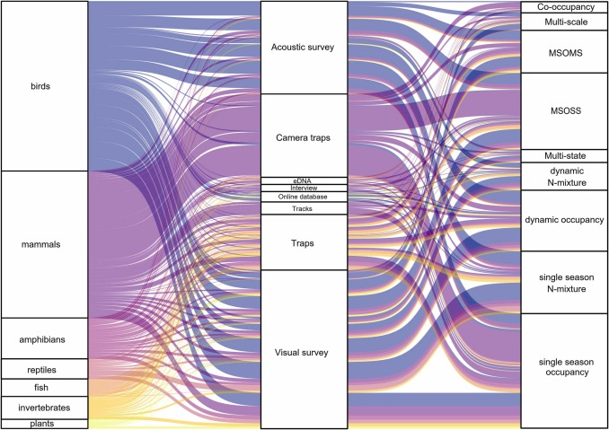
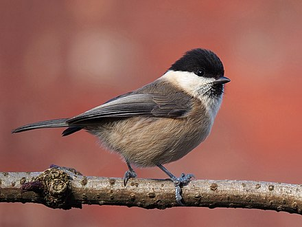
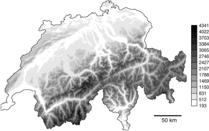
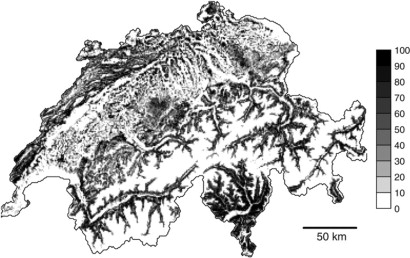
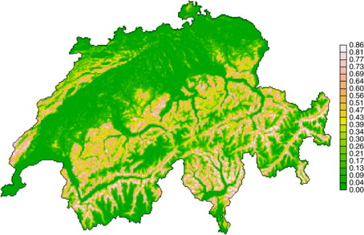

```{r setup, include = FALSE}
options(htmltools.dir.version = FALSE)
knitr::opts_chunk$set(echo = FALSE, fig.align = 'center', warning=FALSE, message=FALSE,fig.retina = 2)
library(WILD8370)
library(nimble)
library(MCMCvis)
source(here::here("R/zzz.R"))
# library(gganimate)
```

# Readings: 
<br/>
> Kéry & Schaub 383-411


---

## State-space models

#### Produce unbiased estimates of $\Large N$ **only** when false-positives and false-negatives cancel each other out on average  
<br/>

#### Produce unbiased estimates of population **indices** $\Large (Np)$ if detection probability has no pattern ove time  
<br/>

#### Do **not** produce unbiased estimates of $\Large N$ or $\Large Np$ if there are temporal patterns in detection probability or false-positive rates

---
## Estimating abundance

#### Unbiased estimates of $\large N$ require estimating $\large p$

#### *Many* methods available:

- Mark-recapture  

- Removal sampling  

- Distance sampling  

- Double observer  

- N-mixture models

---

## Closed N-mixture models

#### The basic idea

- $\large \mathbf J$ sites surveyed

    + Each site has an expected abundance $\large \lambda$
    + Often expressed as a linear model: $log(\lambda_j) = \beta0 + \beta1*x_j$

--
    + State model:  
    
$$\Large N_j \sim Poisson(\lambda)$$

--
- Each site is surveyed $\large \mathbf K$ times

    + During each visit, probability $\large p$ of detecting each individual

--
    + Observation model:  
    
$$\Large y_{j,k} \sim Binomial(N_j, p)$$
---

--- 
## Increasingly Popular Tool 

#### [Rozylowicz et al (2024)](https://www.sciencedirect.com/science/article/pii/S2351989424000428?via%3Dihub)

```{r out.width="50%", echo = FALSE, eval = T}

```

---

## Assumptions of the Closed N-mixture model

1) Poisson and binomial distributions are true descriptions of state/observation processes

2) Abundance at each site is random and independent of abundance at all other sites

3) Population is closed between surveys

4) Observers do not double count individuals

5) All $\large N$ individuals have the same detection probability $\large p$

---
## Advantages and disadvantages of the N-mixture model
#### Advantages

- Count data is "cheap" to collect (relative to mark-recapture)

- Does not require auxillary information (distance, double observer, etc.)

- Analysis is straightforward

---
## Advantages and disadvantages of the N-mixture model
#### Disadvantages

- Count data has less information about $\large p$ than mark-recapture data

- All individuals are equal 

- Requires lots of replication

- Trade-off between temporal replication and spatial replication

- Inference can be sensitive to violating assumptions

---
## Controversy 

#### [Barker et al. (2017)](https://onlinelibrary.wiley.com/doi/full/10.1111/biom.12734)

- Mark-recapture data provides auxillary information about $\large p$ without reference to $\large N$

- Without auxillary information about $\large p$, count data cannot distinguish between N-mixture model or other possible models of $\large N$

---
## Controversy 

#### [Barker et al. (2017)](https://onlinelibrary.wiley.com/doi/full/10.1111/biom.12734)

#### [Kery (2017)](https://esajournals.onlinelibrary.wiley.com/doi/pdf/10.1002/ecy.2093)

- No issues with identifiability of Poisson N-mixture model based on 137 bird data sets from 2,037 sites

- Some parameters not identifiability with negative binomial model (especially with small sample sizes)  

    + problematic because NB often selected based on AIC
    

---
## Controversy 

#### [Barker et al. (2017)](https://onlinelibrary.wiley.com/doi/full/10.1111/biom.12734)

#### [Kery (2017)](https://esajournals.onlinelibrary.wiley.com/doi/pdf/10.1002/ecy.2093)

#### [Link et al. (2018)](https://esajournals.onlinelibrary.wiley.com/doi/abs/10.1002/ecy.2362)

- Estimates from N-mixture models sensitive to violation of double counting and constant $\large \lambda/p$

- Small violations unlikely to be detected using goodness‐of‐fit tests but can influence inference about $\large N$

---
## Closed Occupancy from Basic N-Mixture Models

With abundance data, occupancy comes for free 

$$ N_j \sim Poisson(\lambda)$$
$$ z_j = (N_j \geq 1)$$
--

But sometimes we don't have abundance information. 

---
## Closed Occupancy from Basic N-Mixture Models

We can adjust our model for occupancy 

$$logit(\psi_j) = \beta_0 + \beta_1*x_j $$


$$ z_j \sim Bernoulli(\psi_j) $$

$$ y_{j,k} \sim Bernoulli(z_j, p)$$

--

<br/>
Technically, this is no longer an *N*-mixture model, but it is a similarly functioning hierarchical state-space model. 


---
## Willow Tits Example

The Swiss MHB program ("Monitoring Häufige Brutvögel") has monitored the populations of approximately 150 common avian species since 1999. Sites across Switzerland are sampled 2-3 times each year and the number of birds seen of each species is recorded for each visit. 

One of these species is the Willow Tit, which is just a snobbier version of a Carolina Chickadee. We will use some data provided in Chapter 3 of [Royle and Dorazio (2009)](https://www.sciencedirect.com/science/article/pii/B9780123740977000053) to model occupancy across Switzerland. 

```{r out.width="45%", echo = FALSE, eval = T}

```

---
## Willow Tits Example

Switzerland is well known for it's elevational gradient (the Alps!), which we expect has a large impact on site suitability for Willow Tits.

```{r out.width="50%", echo = FALSE, eval = T}

```

---
## Willow Tits Example

Along with this elevational gradient, we also know that forest cover is inhomogenous throughout the study region. We will use these two covariates to predict the occupancy of Willow Tits across Switzerland. 

```{r out.width="50%", echo = FALSE, eval = T}

```

---
## Willow Tits Example

First we need a model for what causes a site to be occupied. We will use a very simple model that assumes constant detection probability across the 3 visits. Following Royle and Dorazio, we will use a quadratic to explain the effects of elevation.

```{r, eval = F, echo = T, include = T}
library(nimble)
birdmod <- nimbleCode({
  for(i in 1:nsites){
    logit(psi[i]) <- beta0 + beta1*elev[i] + beta2*elev[i]*elev[i] + beta3*forest[i]
    z[i] ~ dbern(psi[i])
    for(j in 1:nvisits){
      y[i,j] ~ dbern(z[i]*p)
    }
  }
  beta0 ~ dnorm(0, 1) #intercept
  beta1 ~ dnorm(0, 1) #elevation
  beta2 ~ dnorm(0, 1) #elevation^2
  beta3 ~ dnorm(0, 1) #forest
  p ~ dbeta(1,1)
})
```

---
## Willow Tits Example

Load the data and scale covariates
```{r, eval =T, echo = T, include= T}
library(WILD8370)
data('willow_tits')
knitr::kable(head(willow_tits, n = 2))
willow_tits$elev_c <- (willow_tits$elev - mean(willow_tits$elev))/sd(willow_tits$elev)
willow_tits$forest_c <- (willow_tits$forest - mean(willow_tits$forest))/sd(willow_tits$forest)

```

---
## Willow Tits Example

Constants
```{r, eval =F, echo = T, include= T}
nimconsts <- list(elev = willow_tits$elev_c, forest = willow_tits$forest_c, 
                  nsites = nrow(willow_tits), nvisits = 3)
```

Data
```{r, eval =F, echo = T, include= T}
nimdat <- list(y = as.matrix(willow_tits[, c('y.1', 'y.2', 'y.3')])) #has to be a matrix
```

Initial values
```{r, eval =F, echo = T, include= T}
niminits <- function(){list(
  p= rbeta(1,1,1),
  beta0 = rnorm(1,0,1),
  beta1 = rnorm(1,0,1),
  beta2 = rnorm(1,0,1),
  beta3 = rnorm(1,0,1),
  z = rep(1, 193) #193 sites
)}
```

---
## Willow Tits Example

Params of interest
```{r, eval =F, echo = T, include= T}
params <- c('p', 'beta0', 'beta1', 'beta2', 'beta3')
```

Run the model
```{r, eval = F, include = T, echo = T}
bird_fit <- nimbleMCMC(code = birdmod,
                     data = nimdat,
                     constants = nimconsts,
                     inits = niminits(),
                     monitors = params,
                     thin = 1,
                     niter = 15000,
                     nburnin = 2500,
                     nchains = 3,
                     samplesAsCodaMCMC = TRUE
                      )
```

---
## Willow Tits Example

Check convergence
```{r hidden}
bird_fit <- readRDS('bird_fit.rds')
```

```{r, eval =T, echo = T, fig.height = 5.25}
MCMCvis::MCMCtrace(bird_fit[,1:3], Rhat = T, n.eff = T, pdf = F)
```
---
## Willow Tits Example

Check convergence

```{r, eval =T, echo = T, fig.height = 5.25}
MCMCvis::MCMCtrace(bird_fit[,4:5], Rhat = T, n.eff = T, pdf = F)
```

---
## Willow Tits Example

Looking at the estimates, it seems like Willow Tits like higher elevations probably like more forested sites.

```{r, eval =F, echo = T}
summary(bird_fit)$quantiles
```
```{r, eval =T, echo = F}
knitr::kable(summary(bird_fit)$quantiles)
```

---
## Willow Tits Example

Let's see what that means for expected occupancy across elevations:

```{r, eval = F, echo =T, include = T, fig.height= 4.5}
library(ggplot2)
outputs <- summary(bird_fit)$quantiles
birds_df <- data.frame(elev = seq(-3, 3, by = .01))
birds_df$pred <- plogis(outputs[1,3] + outputs[2,3]*birds_df$elev + 
                          outputs[3,3]*birds_df$elev*birds_df$elev)
birds_df$elev_normal <- birds_df$elev*sd(willow_tits$elev) + mean(willow_tits$elev) #un-standardize
ggplot(birds_df, aes(x = elev_normal, y= pred))+
  geom_line()+
  theme_classic()+
  xlab('Elevation')+
  ylab('Occupancy Probability')
```
---
## Willow Tits Example

Let's see what that means for expected occupancy across elevations:

```{r, eval = T, echo =F, include = T, fig.height= 4.5}
library(ggplot2)
outputs <- summary(bird_fit)$quantiles
birds_df <- data.frame(elev = seq(-3, 3, by = .01))
birds_df$pred <- plogis(outputs[1,3] + outputs[2,3]*birds_df$elev + outputs[3,3]*birds_df$elev*birds_df$elev)
birds_df$elev_normal <- birds_df$elev*sd(willow_tits$elev) + mean(willow_tits$elev) #un-standardize
ggplot(birds_df, aes(x = elev_normal, y= pred))+
  geom_line()+
  theme_classic()+
  xlab('Elevation')+
  ylab('Occupancy Probability')+
   theme(axis.text = element_text(size = 15))+
  xlim(250, 2190)
```


---
## Willow Tits Example

That's a nice graph, but what about if we wanted to include confidence intervals? 

--

You might instinctively want to calculate this but using the 95% CIs from the beta parameters themselves. 
```{r, eval = F, include = T, echo = T}
birds_df$pred_low <- plogis(outputs[1,1] + outputs[2,1]*birds_df$elev 
                            + outputs[3,1]*birds_df$elev*birds_df$elev)
```

--

However, this will get you the WRONG answer. Each parameter in your model is estimated in conjuction with the other parameters - they are not independent. 


So what do we do instead? 

---
## Willow Tits Example

Instead, we have to use the posterior samples themselves to get a full posterior distribution for the derived variables of interest. We start by only using the last 1000 iterations of each chain - we know the chains converged, so we can feel safe in the validity of our estimates. We'll also turn our samples into a matrix so they're easier to work with

```{r, eval = T, echo = T}
shorter_birds <- as.matrix(window(bird_fit, start = nrow(bird_fit$chain1)-1000))
```

Now we setup an array to hold our posterior distribution. We need it to have as many rows as there are samples and as many columns as there are values of elevation that we want to predict for. 
```{r, eval = T, echo = T}
posterior_dist <- array(NA, c(3000, length(birds_df$elev)))
```

Now we can compute.
```{r, eval = T, echo = T}
for(i in 1:3000){
  posterior_dist[i,] <- plogis(shorter_birds[i,1] + shorter_birds[i,2]*birds_df$elev + 
                                 shorter_birds[i,3]*birds_df$elev*birds_df$elev)
}
```

---
## Willow Tits Example

Now we have the posterior distribution! We could plot this if we really wanted. 

However, what we *actually* want is the quantiles of these parameters, so that we can stick those on a graph. We can calculate those using the `quantile()` function in R. 

We'll save these as part of our data frame using the `apply` function.

```{r, eval =TRUE, echo=TRUE}
birds_df$LCI <- apply(posterior_dist, 2, function(x){quantile(x, 0.025)}) #calculate the LCI 
birds_df$UCI <- apply(posterior_dist, 2, function(x){quantile(x, 0.975)}) #UCI
```

Time to graph!
---
## Willow Tits Example

```{r, eval =TRUE, echo=TRUE, fig.height= 4}
ggplot(birds_df, aes(x = elev_normal, y= pred))+
  geom_ribbon(aes(ymin = LCI, ymax = UCI), fill = 'orange', alpha =.5)+
  geom_line()+
  theme_classic()+
  theme(axis.text = element_text(size = 15))+
  xlab('Elevation')+
  ylab('Occupancy Probability')+
  xlim(250, 2190) #stay within data levels for elevation
```

---
## Willow Tits Example

If you instead use rasters instead of a range for the environmental covariates, you can then produce occupancy maps! This can produce a very nice output for manuscripts. 


```{r out.width="45%", echo = FALSE, eval = T}

```

