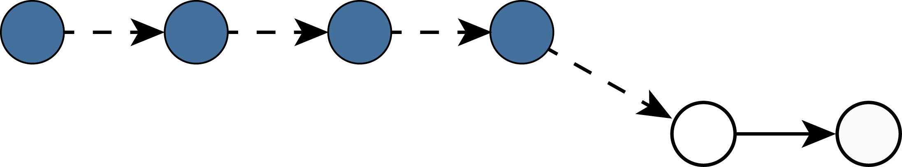
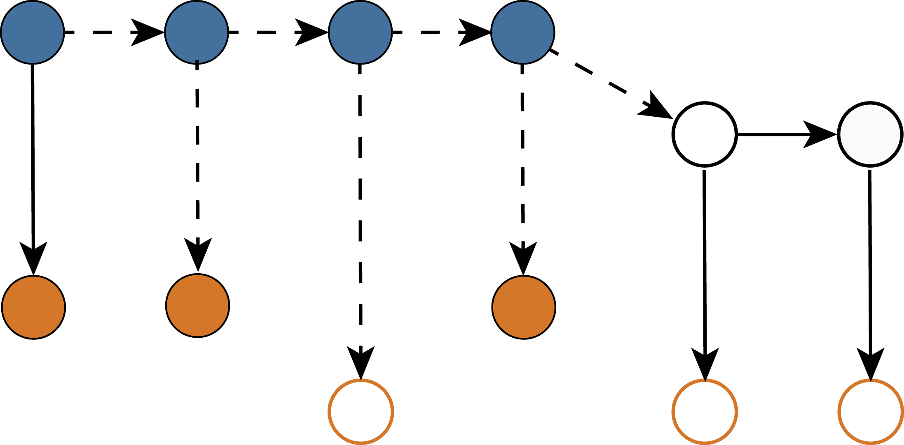

```{r setup, include=FALSE}
options(htmltools.dir.version = FALSE)
knitr::opts_chunk$set(echo = FALSE, fig.align = 'center', warning=FALSE, message=FALSE)
library(WILD8370)
# library(gganimate)
library(kableExtra)
library(nimble)
library(ggplot2)
library(dplyr)
library(nimbleEcology)
```

## Readings

> ### Kéry & Schaub 171-239

> ### [Powell & Gale chp. 10](https://docs.wixstatic.com/ugd/95e73b_3a230cc8eaa64148ad17a8a36c98240b.pdf)


---
## From closed-population models to open-population models

#### All CMR studies have a similar basic design:

.pull-left[
During each sampling occasion

- individuals are captured  

- marked or identified  

- released alive  
]

.pull-right[
```{r out.width="50%"}
knitr::include_graphics("https://upload.wikimedia.org/wikipedia/commons/6/6f/Band_on_pelican_leg_%285282438747%29.jpg")
```
]

--
#### But whats happens next?

--
- In the $\large M_0$ model, we assumed the population was closed to any change in $\large N$ during our study
    + No births, deaths, emigration, or immigration

--
    +  Any $\large 0$ in the capture histories was due to detection error

???
Image courtesy of USFWS Mountain-Prairie, via Wikimedia Commons

---
## From closed-population models to open-population models

#### **Open population** models relax this assumption

- Individuals can enter (births or immigration) or leave the population (deaths or emigration) between sampling occasions

- $\large 0$'s in the capture histories could be because individuals are there but not detected or because they are not there


--
#### Many different forms of open population models 

- Allow estimation of:
    + survival
    + recruitment
    + movement

---
## Open-population models

#### In this lecture, we will focus on estimating survival/emigration

--
```{r out.width = "75%"}

```

---
## Open-population models

#### In this lecture, we will focus on estimating survival/emigration


```{r out.width = "75%"}

```

--
- *Condition on first capture*

---
## Open-population models

#### On the occassion after release, 4 possible scenarios:

- 1) Individual survives and is re-captured (capture history = `11`)  


- 2) Individual survives but is not recaptured (capture history = `10`)  


- 3) Individual dies and is **not available** for recapture (capture history = `10`)  


- 4) Individual survives but leaves the study area and is **not available** for recapture (capture history = `10`)  


---
## Open-population models

#### On the occassion after release, 4 possible scenarios:

- 1) Individual survives and is re-captured (capture history = `11`)  


- 2) Individual survives but is not recaptured (capture history = `10`)  


- 3) Individual dies and is **not available** for recapture (capture history = `10`)  


- 4) Individual survives but leaves the study area and is **not available** for recapture (capture history = `10`)  


#### Not possible to distuingish between scenarios 3 & 4 without additional data

- $\LARGE \phi_t = s_t \times (1 - \epsilon_t)$ 

- $\LARGE \phi_t$: **Apparent survival** (prob. individual survives *and* remains within study area)  

???

$\LARGE \epsilon_t$: probability an individual leaves the study area


---
## Cormack-Jolly-Seber model

#### How do we distinguish between scenarios 2 & 3/4?  

--
#### **CJS model**

- Parameters
    + $\LARGE \phi$: Apparent survival probability

    + $\Large p$: Recapture probability

* The CJS model is named after the three statisticians – Richard Cormack, George Jolly and George Seber – who each independently published a paper introducing more or less the same approach, a year apart ! 

** Even funnier, Richard Cormack and George Jolly were working in the same corridor, would meet every day at coffee break and play a game, but were not aware of each other’s work. 
???

Note that for simplicity, we have removed the $t$ subscript. This implies that apparent survival probability and recapture probability are constant across all occasions.   

However, the CJS model can estimate different apparent survival and recapture probabilities for each occasion, that is $\phi_t$ and $p_t$

---
## Cormack-Jolly-Seber model

#### How do we distinguish between scenarios 2 & 3/4?  


```{r out.width="75%"}
knitr::include_graphics("figs/cjs_flowchart.png")
```

---
## Cormack-Jolly-Seber model


```{r}
cjs_df <- data.frame(animal = c("Indv 1", "Indv 2", "Indv 3", "Indv 4"),
                 ch = c("111", "101", "110", "100"),
                 prb = c("\\(\\phi_1 p_2 \\phi_2 p_3\\)", 
                         "\\(\\phi_1 (1-p_2) \\phi_2 p_3\\)", 
                         "\\(\\phi_1 p_2 \\phi_2 (1-p_3)+(1-\\phi_2)\\)",
                         "\\((1-\\phi_1) + \\phi_1 (1-p_2) (1-\\phi_2 p_3)\\)"))

names(cjs_df) <- c("Individual", "Capture history", "Probability")
cjs_df2 <- cjs_df
cjs_df2[,3] <- c("\\(\\phi_1 p_2 \\phi_2 p_3\\)", "", "", "")
cjs_df2 %>%
  kable("html", align = 'c', escape = FALSE) %>%
  kable_styling(bootstrap_options = c("striped", "hover", "condensed", "responsive"), full_width = TRUE, font_size = 15) 
```

#### Individual 1

- survived interval 1 $\large (\phi_1)$, recaptured on occasion 2 $\large (p_2)$, survived occasion 2 $\large (\phi_2)$, recapture on occasion 3 $\large (p_3)$


---
## Cormack-Jolly-Seber model


```{r}
cjs_df3 <- cjs_df
cjs_df3[,3] <- c("\\(\\phi_1 p_2 \\phi_2 p_3\\)", 
                         "\\(\\phi_1 (1-p_2) \\phi_2 p_3\\)", 
                         "",
                         "")
cjs_df3 %>%
  kable("html", align = 'c', escape = FALSE) %>%
  kable_styling(bootstrap_options = c("striped", "hover", "condensed", "responsive"), full_width = TRUE, font_size = 15) 
```

#### Individual 2

- survived interval 1 $\large (\phi_1)$, not recaptured on occasion 2 $\large (1-p_2)$, survived occasion 2 $\large (\phi_2)$, recapture on occasion 3 $\large (p_3)$

---
## Cormack-Jolly-Seber model

```{r}
cjs_df4 <- cjs_df
cjs_df4[,3] <- c("\\(\\phi_1 p_2 \\phi_2 p_3\\)", 
                         "\\(\\phi_1 (1-p_2) \\phi_2 p_3\\)", 
                         "\\(\\phi_1 p_2 \\phi_2 (1-p_3)+(1-\\phi_2)\\)",
                         "")
cjs_df4 %>%
  kable("html", align = 'c', escape = FALSE) %>%
  kable_styling(bootstrap_options = c("striped", "hover", "condensed", "responsive"), full_width = TRUE, font_size = 15) 
```

#### Individual 3

- survived interval 1 $\large (\phi_1)$, recaptured on occasion 2 $\large (p_2)$

--
    + survived occasion 2 $\large (\phi_2)$, not recaptured on occasion 3 $\large (1 - p_3)$; **or**  

--
    + died during occasion 2 $\large (1-\phi_2)$


---
## Cormack-Jolly-Seber model

```{r}
cjs_df %>%
  kable("html", align = 'c', escape = FALSE) %>%
  kable_styling(bootstrap_options = c("striped", "hover", "condensed", "responsive"), full_width = TRUE, font_size = 15) 
```

#### Individual 4

- died during interval 1 $\large (1-\phi_1)$; **or**  

--
- survived occasion 1 $\large (\phi_1)$, not recaptured on occasion 2 $\large (1 - p_2)$, died during occasion 2 $(1-\phi_2)$; **or**  

--
- survived occasion 1 $\large (\phi_1)$, not recaptured on occasion 2 $\large (1 - p_2)$, survived occasion 2 $\large (\phi_2)$, not recaptured on occasion 3 $\large (1 - p_3)$  

---
## CJS model as a state-space model

#### Using the tools we've learned this semester, it's relativley straightfoward to write the CJS model as a state-space model:

--
#### Process model, capture occassion 1
$$\large z_{i,f_1} = 1$$

--
#### Process model, capture occasion 2+

--
$$\large z_{i,t} \sim Bernoulli(z_{i,t-1}\phi)$$

--
#### Observation model

$$\large y_{i,t} \sim Bernoulli(z_{i,t}p)$$

---
## CJS model with time-variation

#### As for the other models we've seen this semester, it's possible to add temporal variation to the CJS model

--
$$\Large logit(\phi_t) = \mu + \epsilon_t$$

$$\Large \epsilon_t \sim normal(0, \sigma^2_{\phi})$$

--
$$\Large logit(p_t) = \mu + \xi_t$$

$$\Large \xi_t \sim normal(0, \sigma^2_{p})$$


---
## Identifiability of the CJS model with time-variation

#### In the fully time-dependent model, $\large \phi_T$ and $\large p_T$ are not identifiable

- the model will return posteriors for both parameters (because each has a prior) but the model will not be able to separately estimate both parameters
    + posteriors will actually be for $\phi_T \times p_T$

---
## Identifiability of the CJS model with time-variation

#### Why is this?

--
- In a CMR study with two occassions (**note** - never do this!):
    + 100 individuals captured on first occasion
    + 60 of those individuals recaptured on the second occasion

--
- Expected number of recaptures $= N \times \phi \times p$
    + $60 = 100 \times 0.8 \times 0.75$
    + $60 = 100 \times 0.9 \times 0.667$
    + $60 = 100 \times 0.6 \times 1.00$

--
- No unique solution
    + Separating $p$ from $\phi$ requires *internal* zeros
    
---
## Identifiability of the CJS model with time-variation

#### What can you do:

1) Constant $\large p$

2) Covariates on $\large \phi$ and $\large p$

3) Informative priors


---
## Assumptions of the CJS model

#### 1) Every animal has the same chance of capture, p*

#### 2) Every animal has same probability of surviving $\large \phi$*

#### 3) Marks are not lost 

#### 4) Samples are instantaneous (short periods)  

#### 5) All emigration is permanent (`101` must indicate $1-p$) 

#### 6) Fates of animals  are independent of other animals 

*In the original papers. 

---
## CJS Model in Nimble

CJS models are very similar to known-fate models minus the observation process. 

```{r, eval=TRUE, echo = T}
cjs <- nimbleCode({
phi ~ dbeta(1, 1)
p ~ dbeta(1, 1)
for(i in 1:nind){
  z[i,1] <- 1 #obviously, or you wouldn't have captured it
  for(t in (first[i]+1):nocc){
    z[i,t] ~ dbern(phi*z[i,t-1])
    y[i,t] ~ dbern(p*z[i,t])
  }
}
})
```

---
## CJS Models - nimbleEcology

You can also use the `nimbleEcology` package to help you out. We won't discuss it in this class, but you can make your OWN distributions in Nimble as long as you know the likelihood. The `nimbleEcology` package is essentially a group of distributions that other people have made for you. 

There are 4 options for CJS distributions in this package:

  + dCJS_ss: Both survival and capture probability are time-independent (scalar).
  
  + dCJS_sv: Survival is time-independent (scalar). Capture probability is time-dependent (vector).
  
  + dCJS_vs: Survival is time-dependent (vector). Capture probability is time-independent (scalar).
  
  + dCJS_vv: Both are time-dependent (vector).
  

The advantage of using this package is significantly faster computation time.

---
## CJS Models - nimbleEcology

Here's an example with dCJS_sv. This means survival is constant while the capture probability changes over time. Note that `z` is not in the model! 

```{r, echo = T, eval =F}
library(nimbleEcology)
cjs2 <- nimbleCode({
  for(i in 1:nind){
    y[i, first[i]:nocc] ~ dCJS_sv(probSurvive = phi, 
                                probCapture = p[first[i]:nocc])
  }
  
  phi ~ dbeta(1, 1)
  for(t in 1:nocc){
    p[t] ~ dbeta(1, 1)
  }
})
```

---
## Example - Wyoming Amphibians

Researchers from USGS have been capturing and marking frogs and toads in Wyoming and Montana since 2001 to research survival in response to chytrid fungus (*Batrachochytrium dendrobatidis*). Here's the citation:
Russell, R.E., Halstead, B.J., Fisher, R.N., Muths, E.L., Adams, M.J., and Hossack, B.R., 2019, Amphibian capture mark-recapture: U.S. Geological Survey data release, https://doi.org/10.5066/P9LNLEDF.

This information is saved in the `WyomingFrogs` dataset. You can also find this dataset online at the citation above.


```{r, echo = T}
data('WyomingFrogs')
head(frog_caps, n = 3)
```

---
## Example - Wyoming Amphibians

For now we will just look at the boreal toad (*Anaxyrus boreas*) in Montana. We'll start by subsetting and then organizing the date column. 

```{r, echo = T}
btoads <- subset(frog_caps, frog_caps$Species == 'A.boreas' & frog_caps$Project == 'MT')
btoads$id <- as.numeric(as.factor(btoads$Ind.ID))
nind <- length(unique(btoads$id))
```

This leaves us with 1672 individuals. 

```{r, echo = T}
btoads$date <- as.Date(btoads$Survey.Date, format = '%m/%d/%y')
btoads$year <- as.numeric(format(btoads$date, '%y'))
head(btoads, n = 2)
```

---
## Example - Wyoming Amphibians
Time to organize the capture information. 

```{r, echo = T}
nocc <- 13 #13 years of data
y <- array(0, c(nind, nocc))
z <- array(NA, c(nind, nocc))
for(k in 1:nrow(btoads)){
  y[btoads$id[k],btoads$year[k]-3] <- 1
  z[btoads$id[k],btoads$year[k]-3] <- 1
}
first <- apply(y, 1, function(row) {
  which(row > 0)[1]  # Returns the index of the first detection
})
```

```{r, echo = T}
range(first)
```

Uh-oh, we can't have animals where first = the last occasion, since we loop through first+1:last. 
---
## Example - Wyoming Amphibians
```{r, echo = T}
bad <- which(first == nocc)
y <- y[-c(bad),] #remove bad ones
z <- z[-c(bad),]
first <- first[-c(bad)]
nind2 <- nind-length(bad) #new nind
```


---
## Example - Wyoming Amphibians

Prepare nimble objects for the time-changing detection CJS model using the normal synatx:

```{r, echo = T}
nd <- list(y = y, z = z)
nc <- list(first = first, nocc = nocc, nind = nind2)
z.init <- z
last <- apply(y, 1, function(row) {
  max(which(row > 0))  # Returns the index of the last detection
})
for(j in 1:nind2){
  z.init[j, 1:(first[j]-1)] <- 1 #start everyone alive before first capture 
  z.init[j, (first[j]+1):last[j]]  <- 1#alive entire time it was seen
  if(last[j] < nocc){
    z.init[j, (last[j]+1):nocc] <- 0 #kill everyone after last detection
  }
}
z.init[!is.na(z)] <- NA #no inits for known data
ni <- list(phi = rbeta(1,1,1), p = rbeta(nocc,1,1), z = z.init)
params <- c('phi', 'p')
```

---
## Example - Wyoming Amphibians

This is the model we'll run. Not very informative about detection probability, but we'll see how it goes:

```{r, eval=TRUE, echo = T}
cjs <- nimbleCode({
phi ~ dbeta(1, 1)
for(t in 1:nocc){
    p[t] ~ dbeta(1, 1)
}
for(i in 1:nind){
  z[i,1] <- 1 #obviously, or you wouldn't have captured it
  for(t in (first[i]+1):nocc){
    z[i,t] ~ dbern(phi*z[i,t-1])
    y[i,t] ~ dbern(p[t]*z[i,t])
  }
}
})
```

---
## Example - Wyoming Amphibians

Check model:
```{r, echo = T, eval = T}
prepnim <- nimbleModel(code = cjs, constants = nc,
                           data = nd, inits = ni, calculate = T)
prepnim$initializeInfo() #will tell you what is or isn't initialized
prepnim$calculate() #if this is NA or -Inf you know it's gone wrong
```

---
## Example - Wyoming Amphibians

```{r, echo = T, eval = F}
toads.out <- nimbleMCMC(code = cjs,
                     data = nd,
                     constants = nc,
                     inits = ni,
                     monitors = params,
                     thin = 1,
                     niter = 5000,
                     nburnin = 2500,
                     nchains = 3,
                     samplesAsCodaMCMC = TRUE
                      )
```

---
## Example - Wyoming Amphibians

```{r, echo = F, eval = T}
toads.out <- readRDS('toads1.RDS')
MCMCvis::MCMCtrace(toads.out, pdf = F, params = c('p[13]', 'phi'), exact = T, ISB = F)
```

---
## Example - Wyoming Amphibians

We can also run the model using the nimbleEcology distributions. 
```{r, echo = T, eval =T}
cjs2 <- nimbleCode({
  for(i in 1:nind){
    y[i, first[i]:nocc] ~ dCJS_sv(probSurvive = phi, 
                                probCapture = p[first[i]:nocc])
  }
  
  phi ~ dbeta(1, 1)
  for(t in 1:nocc){
    p[t] ~ dbeta(1, 1)
  }
})
```

---
## Example - Wyoming Amphibians

We don't need the z information in this model, but everything else stays the same.
```{r, echo = T, eval = F}
nd$z <- NULL
ni$z <- NULL
toads.out2 <- nimbleMCMC(code = cjs2,
                     data = nd,
                     constants = nc,
                     inits = ni,
                     monitors = params,
                     thin = 1,
                     niter = 5000,
                     nburnin = 2500,
                     nchains = 3,
                     samplesAsCodaMCMC = TRUE
                      )
```

---
## Example - Wyoming Amphibians

Exactly the same result

```{r, echo = F, eval = T}
toads.out2<- readRDS('toads.out2.RDS')
MCMCvis::MCMCtrace(toads.out2, pdf = F, params = c('p[13]', 'phi'), exact = T, ISB = F)
```