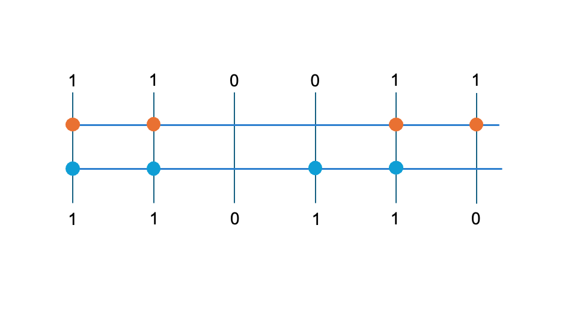
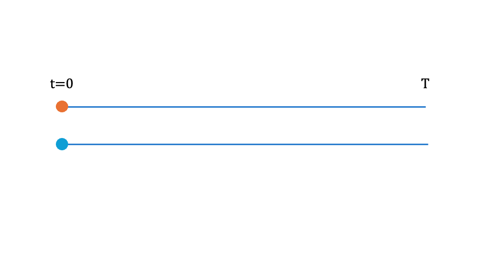
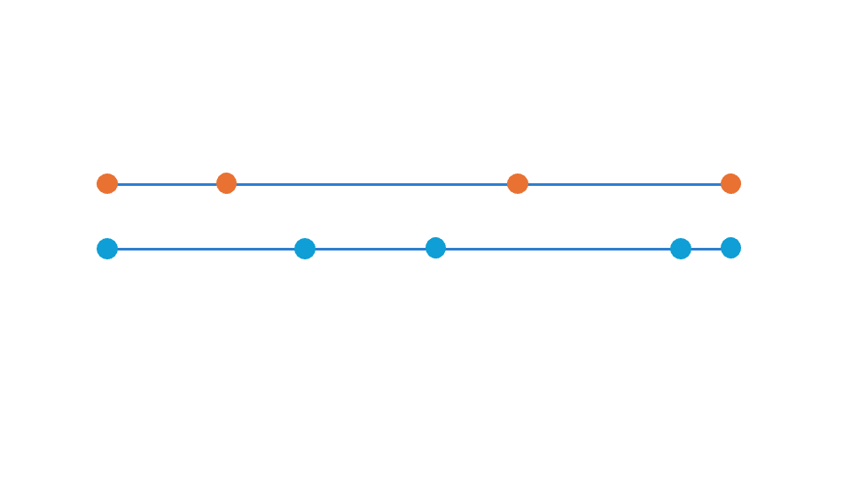
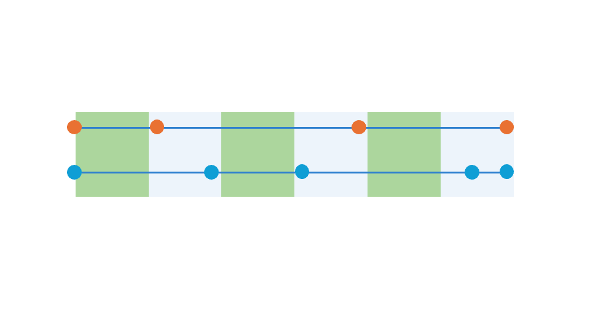
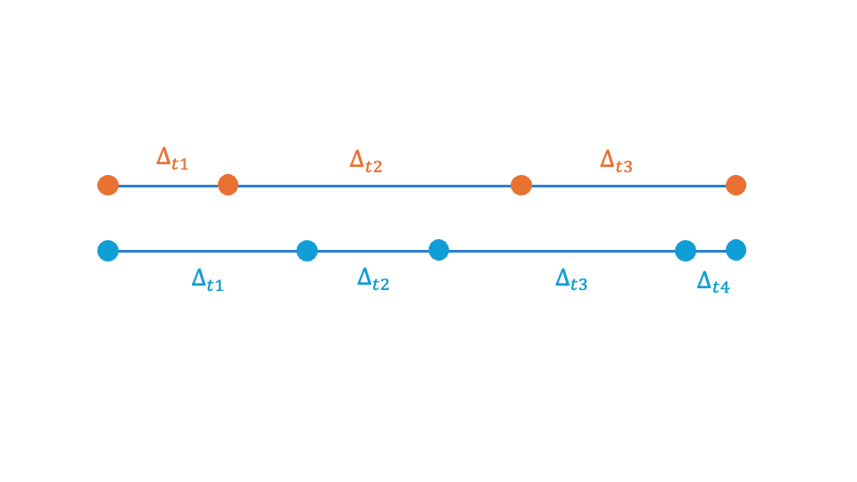

```{r setup, include = FALSE}
options(htmltools.dir.version = FALSE)
knitr::opts_chunk$set(echo = FALSE, fig.align = 'center', warning=FALSE, message=FALSE,fig.retina = 2)
library(WILD8370)
source(here::here("R/zzz.R"))
# library(gganimate)
```

## Readings

> [Rushing (2023) J. Anim Ecol. 92 (4), 936-944](https://besjournals.onlinelibrary.wiley.com/doi/full/10.1111/1365-2656.13902)

---
# discrete vs continuous time

For all capture-recapture models we have seen so far, time was formulated as *discrete* intervals

--

Treating time as discrete makes sense when individuals can only be encountered during distinct sampling occasions, which are often pre-defined parts of the study design

--

Often, however, "captures" are not limited to discrete, pre-defined sampling occasions but instead can occur more or less continuously 

- Camera traps

- Automated telemetry

- Band re-sights/re-encounters

---
# discrete vs continuous time

Discrete-time formulations assume that capture occasions are short relative to the time between occasions

- This assumption is necessary because survival probabilities correspond to a specific amount of time

- All individuals are assumed to survive the same amount of time between encounters

```{r out.width = "75%"}

```

---
# continuous time

```{r out.width = "75%"}

```

---
# continuous time

```{r out.width = "75%"}

```

---
# continuous time

```{r out.width = "75%"}

```


---
# continuous time

```{r out.width = "75%"}

```

---
# continuous time

Both the number of encounters and the time between encounters is obviously very different between these two individuals

But the *post-hoc* binning of time into discrete intervals produces the same encounter histories

```{r out.width = "75%"}

```

---
# continuous time

Instead of binning, we could treat the observations as occurring in continuous time by directly modeling the time between detections

```{r out.width = "75%"}

```


---
# continuous time

How do we model continuous detections? 

Generally, continuous processes are modeled as "time to event" - i.e., how much time passes before the "event" of interest happens

- Many types of "events" - earthquakes, appliance failure, 

--

In the case of survival models, what "events" are we interested in?

--

- Mortality and detection

--

Time to event models are based on *hazard rates* - the number of events expected to occur within a (usually short) unit of time

- For mortality events, the hazard rate is the "expected number of deadly events occurring per time-unit for an immortal individual" [(Ergon et al. 2018)](https://besjournals.onlinelibrary.wiley.com/doi/full/10.1111/2041-210X.13059)

- For detection events, the hazard rate is the expected number of detections occurring per time-unit

---
# hazard rates vs survival probability

Hazard rates and survival probabilities are inversely related 

- As hazard rate increases, survival probability decreases

--

More specifically, for any amount of time $\Delta$:

$$\Large \phi = e^{-h\Delta}$$
```{r,  fig.width=7, fig.height=4}
h <- c(0.05, 0.1)

Delta <- seq(from = 1, to = 20)

phi1 <- exp(-h[1] * Delta)
phi2 <- exp(-h[2] * Delta)
ggplot(data.frame(Delta = Delta, phi = c(phi1, phi2), 
                  h = as.factor(rep(h, each = length(Delta))))) +
  geom_path(aes(x = Delta, y = phi, color = h)) +
  scale_y_continuous(expression(phi)) +
  scale_x_continuous(expression(Delta)) +
  theme(legend.title = element_text())
```


---
# the cjs as a multistate model

The CJS model we previously saw can be formulated as a multistate model with 2 states

- What are the states?

--

- Alive and Dead (or emigrated) 

.left-column[
<br/>
<br/>
<br/>
#### True state at time *t*
]

.right-column[
<center>
#### True state at time *t + 1*
</center>
```{r}
library(kableExtra)
ms_df <- data.frame(state = c("Alive", "Dead"),
                 A = c("\\(\\phi\\)", 
                       "0"),
                 Dead = c( "\\(1 - \\phi\\)",
                           "1"))

names(ms_df) <- c("", "Alive", "Dead")
ms_df %>%
  kable("html", align = 'c', escape = FALSE) %>%
  kable_styling(bootstrap_options = c("striped", "hover", "condensed", "responsive"), 
                full_width = TRUE, font_size = 14) 
```

]

---
# the cjs as a continuous-time model

Instead of formulated the model in terms of survival probability, we need to formulate it in terms of hazard rate

--

Fortunately, we just need to modify the transition matrix to become an *intensity matrix* 
$$\large {\mathbf{Q} = \begin{bmatrix}
-h & h\\
0 & 0
\end{bmatrix}}$$

--

#### Notes:

- The intensity matrix is still interpreted as transitions *from row i to column j* but instantaneously rather than between discrete sampling occasions

- The rows of the intensity matrix have to sum to 0


---
# from the intensity matrix to transition probabilities


As we saw earlier, hazard rates can be converted to survival probabilities using $\phi = e^{-h\Delta}$

--

We can similarly convert the intensity matrix to a transition probability matrix using the *matrix exponential* 

$$\Large \Phi = e^{Q \Delta}$$

Note that the matrix exponential is not the same the exponential of a scalar! 

--

Importantly, the transition probabilities in $\Phi$ account for intermediate states an individual *could have experienced* within the interval $\Delta$

- In effect, this operation marginalizes over all possible ways an individual could transition between states

- More relevant when there are > 2 states

---
# from the intensity matrix to transition probabilities

For example, if:

$$\large {\mathbf{Q} = \begin{bmatrix}
-0.2 & 0.2\\
0 & 0
\end{bmatrix}}$$

the probabilities of remaining alive (or not) after 5.6 units of time is:


$$\large {\mathbf{\Phi} = e^{-Q \times 5.6} = \begin{bmatrix}
0.33 & 0.67\\
0 & 1
\end{bmatrix}}$$

Note that the rows of $\Phi$ sum to 1, as expected

---
# the cjs as a continuous-time model

How does this allow us to estimate survival? Imagine an individual that is released at $t=0$ and then re-encountered alive at times $t = 1.3, 4.5, 9.2$

--

First, we need to calculate the time between detections:

```{r echo = T}
t <- c(0, 1.3, 4.5, 9.2)
(delta <- diff(t))
```

---
# the cjs as a continuous-time model

.pull-left[
```{r echo = T}
Q <- matrix(c(-0.2, 0, 0.2, 0), 2, 2)
(Phi1 <- expm::expm(Q * delta[1]))
(Phi2 <- expm::expm(Q * delta[2]))
(Phi3 <- expm::expm(Q * delta[3]))
```
]

.pull-right[
What probabilities from these matrices correspond to the re-encounters?
]

---
# the cjs as a continuous-time model

Assume the study lasts 15 time units. From the last detection to the end of the study:

```{r echo = T}
(Phi4 <- expm::expm(Q * (15 - t[4])))
```

What probabilities from this matrix corresponds to the last encounter to the end of the study?

--

Going back to the beginning of the semester, we can calculate the total (log) likelihood of this encounter history as:

```{r echo = T}
log(Phi1[1, 1]) + log(Phi2[1, 1]) + log(Phi3[1, 1]) + log(sum(Phi4[1, ]))
```

---
# the cjs as a continuous-time model

But wait! That was just the likelihood of surviving between each encounter. 

What is this model missing?

--

- Detection probability!

--

Assuming the detection rate of alive individuals is $\lambda$ (and is 0 for dead individuals), the detection process can also be formulated as an intensity matrix:

$$\large {\mathbf{\Lambda} = \begin{bmatrix}
\lambda & 0\\
0 & 0
\end{bmatrix}}$$

And probability of being detected after $\Delta$ units of time (but not before) is $\large \Lambda e^{-\Lambda \Delta}$

---
# the cjs as a continuous-time model

We can combine the two intensity matrices to calculate the probability of surviving and being detected after $\Delta$:

$$\Large \Gamma = e^{Q\Delta} \times \Lambda e^{-\Lambda \Delta} = \Lambda e^{(Q \Delta - \Lambda \Delta)} = \Lambda e^{(Q-\Lambda) \Delta}$$
--

For the first encounter of our imaginary individual: 

```{r echo = T}
Lambda <- matrix(c(0.5, 0, 0, 0), 2, 2)
(Gamma1 <- Lambda %*% expm::expm((Q - Lambda) * Delta[1]))
```

What is the interpretation of each element of $\Gamma$?

--

- $\Gamma_{1,1}$ = if alive at time $t_0$, probability of being alive and detected at $t_1$
- $\Gamma_{2,1}$ = if dead at time $t_0$, probability of being alive and detected after $t_1$
- $\Gamma_{1,2}$ = if alive at time $t_0$, probability of being dead and not detected at $t_1$
- $\Gamma_{2,1}$ = if dead at time $t_0$, probability of being dead and not detected after $t_1$

---
# the cjs as a continuous-time model

Because the individual was *not* detected after the last encounter:

$$\Large \Gamma = e^{(Q-\Lambda) (T - t)}$$

```{r echo = T}
(Gamma4 <- expm::expm((Q - Lambda) * (15 - t[4])))
```

and thus, the total log likelihood of the encounter history is:

```{r echo = T, eval = F}
log(Gamma1[1,1]) + log(Gamma2[1,1]) + log(Gamma3[1,1]) + log(sum(Gamma4[1,1:2])) 
```

---
# continuous time models

For "capture-recapture" data that is not restricted to pre-defined, discrete sampling occasions, continuous-time models may be more appropriate

- no need to arbitrarily "bin" detections (less bias, loss of information)

- computational efficiency (in some cases)

- hazard rates are easily interpreted and compared (Ergon et al. 2018)

- "easily" expanded to >2 states, temporal variation, co-variates, etc.

--

But...

- less familiar to ecologists and fewer resources for learning

- coding can be challenging (as we will see in lab)

- certain circumstances can be challenging to formulate (deterministic transitions, behavioral effects)

- computational efficiency (in some cases)


