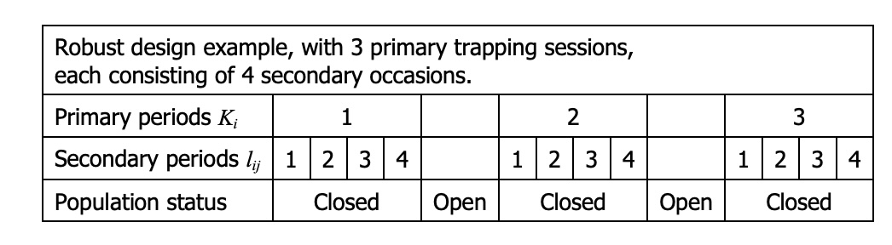

```{r setup, include = FALSE}
options(htmltools.dir.version = FALSE)
knitr::opts_chunk$set(echo = FALSE, fig.align = 'center', warning=FALSE, message=FALSE,fig.retina = 2)
library(WILD8370)
library(nimble)
library(MCMCvis)
library(ggforce)
source(here::here("R/zzz.R"))
# library(gganimate)
```
## Readings

> 


> 

---
## Closed Capture-mark-recapture

#### Key to closed CMR is that because individuals do not enter or leave the population, we assume any 0 in the capture history is non-detection $\large (1-p)$

- in simplest model, easy to translate capture history into probabilistic statements based only on $p$:

.pull-left[
##### Individual 1: $\large 101101$  
##### Individual 2: $\large 011001$  
]

.pull-right[
#### $\large p(1-p)pp(1-p)p$  
#### $\large (1-p)pp(1-p)(1-p)p$
]

---
## Closed CMR models

#### In all closed CMR models, $\large N$ is unknown

$$\Large z_i \sim Bernoulli(\psi)$$


$$\Large y_{ik} \sim Bernoulli(z_ip)$$


$$\Large \psi \sim beta(1,1)$$

$$\Large p \sim beta(1,1)$$


$$\Large N = \sum_{i=1}^M z_i$$

---
## Open Capture-mark-recapture

#### In open populations, we **cannot** assume any 0 in the capture history is non-detection.

Consider the following capture history 

$$\large 101$$


  + In a closed model, $\large p(1-p)p$  
  
  <br/>
  
  + In an open model:  $\large (p_1*\psi_1)*((1-p_2)*\psi_2 + (1-\psi_2))*(p_3*\psi_3)$  

--

<br/>

If we want to model $\large \psi$ and $\large p$ as changing over time, we will need a *robust design* framework.

---
## Robust Design

You have seen the robust design before, we just didn't call it anything fancy. 


```{r out.width = "75%"}

```

<br/>

There is no disadvantage to using a robust design other than the cost of sampling, and most modern studies use this framework. 


---
## Robust Design

CJS models were first used in the late 60's/early 70's to look at survival across time. The robust design didn't appear until the 80s.


If observations only happen once per primary period, CJS models cannot not be modified for heterogeneity or permanent trap response
among individuals. Remember the assumptions of the original CJS models:

  + Every animal has the same chance of capture, p
  
  + Every animal has same probability of surviving $\large \phi$


<br/>

Closed CJS models are robust to this un-modeled variation; Open models are *NOT*

--

In his original papers, the likelihood was estimated in steps, by first estimating each primary period as a closed population model and then separately estimating the likelihood of moving from one time period to the next. 


We no longer estimate the likelihood in this exact way, but we have 40+ years of technology and research on our side :) 


---
## Assumptions of the Open C-R Models

+ Tagged animals are a random sample of the population of interest

<br/>

+ Numbers of releases are known

<br/>

+ Tagging is accurate, no tag loss, no misread tags, no data entry errors.

<br/>

+ The fate of individual animals and the fates of animals in differing cohorts are independent.


