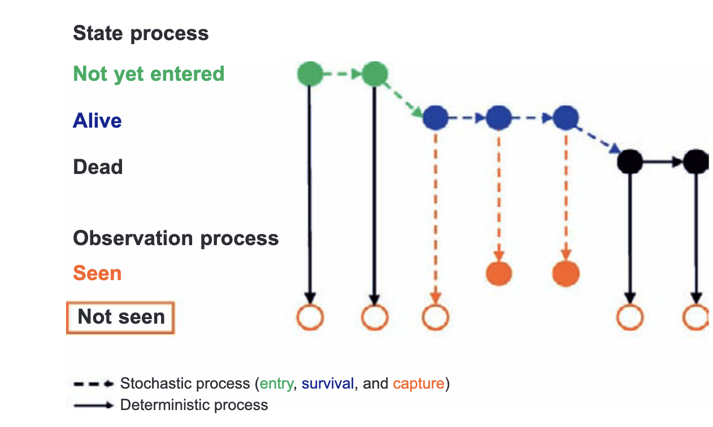

```{r setup, include = FALSE}
options(htmltools.dir.version = FALSE)
knitr::opts_chunk$set(echo = FALSE, fig.align = 'center', warning=FALSE, message=FALSE,fig.retina = 2)
library(WILD8370)
library(nimble)
library(MCMCvis)
library(ggforce)
source(here::here("R/zzz.R"))
# library(gganimate)
```
## Readings

> Analysis of Capture-Recapture Data By Rachel S. McCrea, Byron J. T. Morgan


> Kéry & Schaub Chapter 10

---
## Closed Capture-mark-recapture

#### Key to closed CMR is that because individuals do not enter or leave the population, we assume any 0 in the capture history is non-detection $\large (1-p)$

- in simplest model, easy to translate capture history into probabilistic statements based only on $p$:

.pull-left[
##### Individual 1: $\large 101101$  
##### Individual 2: $\large 011001$  
]

.pull-right[
#### $\large p(1-p)pp(1-p)p$  
#### $\large (1-p)pp(1-p)(1-p)p$
]

---
## Closed CMR models

#### In all closed CMR models, $\large N$ is unknown

$$\Large z_i \sim Bernoulli(\psi)$$


$$\Large y_{ik} \sim Bernoulli(z_ip)$$


$$\Large \psi \sim beta(1,1)$$

$$\Large p \sim beta(1,1)$$


$$\Large N = \sum_{i=1}^M z_i$$

---
## Open Capture-mark-recapture

#### In open populations, we **cannot** assume any 0 in the capture history is non-detection.

Consider the following capture history 

$$\large 101$$


  + In a closed model, $\large p(1-p)p$  
  
  <br/>
  
  + In an open model:  $\large (p_1*\psi_1)*((1-p_2)*\psi_2 + (1-\psi_2))*(p_3*\psi_3)$  

--

<br/>

If we want to model $\large \psi$ and $\large p$ as changing over time, we will need a *robust design* framework.

---
## Robust Design

You have seen the robust design before, we just didn't call it anything fancy. 


```{r out.width = "75%"}
knitr::include_graphics("figs/rd.jpg")
```

<br/>

There is no disadvantage to using a robust design other than the cost of sampling, and most modern studies use this framework. 


---
## Robust Design

CJS models were first used in the late 60's/early 70's to look at survival across time. The robust design didn't appear until the 80s.


If observations only happen once per primary period, CJS models cannot not be modified for heterogeneity or permanent trap response
among individuals. Remember the assumptions of the original CJS models:

  + Every animal has the same chance of capture, p
  
  + Every animal has same probability of surviving $\large \phi$


<br/>

Closed CJS models are robust to this un-modeled variation; Open models are *NOT*

--

In his original papers, the likelihood was estimated in steps, by first estimating each primary period as a closed population model and then separately estimating the likelihood of moving from one time period to the next. 


We no longer estimate the likelihood in this exact way, but we have 40+ years of technology and research on our side :) 

---
## The Open Population
```{r out.width = "75%"}

```

---
## Assumptions of the Open C-R Models

+ Tagged animals are a random sample of the population of interest

<br/>

+ Numbers of releases are known

<br/>

+ Tagging is accurate, no tag loss, no misread tags, no data entry errors

<br/>

+ The fate of individual animals and the fates of animals in differing cohorts are independent

<br/>

+ All animals, both marked and unmarked have the *same* capture probability (if you want to violate this, use an SCR models)


---
## Open C-R Models - Restricted Dynamic Occupancy
#### Very similar to open occupancy models, except you can't come back from the dead
$$\Large z_{i1} \sim Bernoulli(\psi)$$
$$\Large z_{i,t} \sim Bernoulli(z_{i,t-1} * \phi+(1-\prod_{t= 1}^{t-1} z_{it})\gamma)$$


$$\Large y_{it} \sim Binomial(z_{it}p, J)$$


$$\Large \psi \sim beta(1,1)$$


$$\Large N_t = \sum_{i=1}^M z_{it}$$
---
## Open C-R Models - Restricted Dynamic Occupancy

What does this mean in the equation? 

$$\Large (1-\prod_{t= 1}^{t-1} z_{it})\gamma$$

In these models, $z_{it}$ = 0 means one of two things:

  + This individual was previously alive and has died
    
  + This individual is availble to enter the population but hasn't entered it yet 
    

<br/> 

We only want individuals that have not yet been born (or immigrated in) to enter the population. No zombies. 

---
## Open C-R Models - Restricted Dynamic Occupancy

One problem with this formulation is that we only have a fixed number of individuals ($M$) in our augmented population  (that's why we augmented in the first place). 

<br/>

In time period 1, the expected number of newly arriving individuals is $M\gamma_1$ (everyone is new). In time period 2, it is $M(1-\gamma_1)\gamma_2$.  More generally, it is $M \prod_{i=1}^{t-1}(1-\gamma_i)\gamma_t$. 

<br/>

Thus even if per capita recruitment is stable over time, the expected number of recruits will tend to **decrease** and $\gamma$ becomes a biologically meaningless number. 

<br/>

This is not necessarily a problem and can be partially avoided by allowing $\gamma$ to change over time. 

---
## Open C-R Models - Restricted Dynamic Occupancy

Imagine a population that start with 20 individuals and $\gamma$ = .2. Our augmented population brings us up to 200 individuals. Survival does not impact recruitment. 


```{r}
M <- 200
gamma <- .2
nocc <- 10
Z <- array(NA, c(10, 4))
Z[1,] <- c(180, 20, 20, gamma)
qgamma <- cprob <- array(NA)
cprob[1] <- gamma
qgamma[1] <- 1- gamma
for(t in 2:nocc){
  Z[t, 3] <- round(Z[t-1,1]*.2) #new 
  Z[t, 2] <- Z[t-1, 2] + Z[t, 3] #have been alive
  Z[t, 1] <- Z[t-1,1] - Z[t,3]
  Z[t, 4] <- Z[t, 3]/Z[t, 1]
}
colnames(Z) <- c("Avail", "Not Avail", "Recruits", "Recruitment Probability")
Z
```

---
## Open C-R Models - Restricted Dynamic Occupancy

If the number of recruits is stable over time (rather than $\gamma$), how does entry probability have to change to accommodate that?

```{r}
M <- 200
gamma <- .2
nocc <- 10
Z <- array(NA, c(10, 4))
Z[1,] <- c(180, 20, 20, gamma)
for(t in 2:nocc){
  Z[t, 3] <- 20
  Z[t, 2] <- Z[t-1, 2] + Z[t, 3] #have been alive
  Z[t, 1] <- Z[t-1,1] - Z[t,3]
  Z[t, 4] <- Z[t, 3]/Z[t, 1]
}
colnames(Z) <- c("Avail", "Not Avail", "Recruits", "Entry Probability")
Z
```

---
## Restricted Dynamic Occupancy in Nimble


---
## Restricted Dynamic Occupancy Pros and Cons

Pros:

  + Relatively fast 
  
  + Fairly simple code (all things considered)
  
  

Cons: 

  + Gamma parameter is biologically meaningless 
  
  + Can't put a prior on the superpopulation (total ever alive)

---
## Open C-R Models - Per Capita

An alternative way of modeling recruitment is to use per-capita recruitment. 

Let $\Large A_{t}$ represent the sum of all the individuals available for recruitment in time $t$. Then instead of introducing recruitment via:

$$\Large (1-\prod_{t= 1}^{t-1} z_{it})\gamma$$

We use:

$$\Large (1-\prod_{t= 1}^{t-1} z_{it})\gamma_t'$$
where 
$$\Large \gamma'_t = \frac{N_{t-1}}{A_{t-1}}\gamma$$
Thus we are weighting the value of $\gamma$ by the number of individuals that are alive in the last time period and the total number still available to be recruited.


---
## Open C-R Models - Per Capita

Imagine that same population that started with 20 individuals and $\gamma$ = .2. Our augmented population brings us up to 200 individuals. Let $\phi$ = 0.95. 

```{r}
M <- 200
nocc <- 10
gamma <- .2
phi <- .95
gammaPrime <- array(NA, nocc)
Z <- array(NA, c(10, 5))
Z[1,] <- c(180, 20, 20, 20, gamma)
for(t in 2:nocc){
  gammaPrime[t] <- Z[t-1, 4]/Z[t-1, 1] * gamma
  Z[t, 3] <- rbinom(1, Z[t-1, 1], gammaPrime[t]) #new 
  Z[t, 2] <- Z[t-1, 2] + Z[t, 3] #have ever been alive
  Z[t, 1] <- Z[t-1, 1] - Z[t, 3]
  Z[t, 4] <- rbinom(1, Z[t-1, 4], phi)
  Z[t, 5] <- gammaPrime[t] 
}

colnames(Z) <- c("Avail", "Not Avail", "Recruits",  'Now Alive', "Entry Probability")
Z
```

---
## "POPAN Style" Superpopulation Model 


---
## Pros and Cons - POPAN 

One limitation of the POPAN data type is with the use of individual covariates.  

Super-populations size (N) estimates the number of animals never captured, this parameter includes animals for which the individual covariate is not known.  Thus, modeling N as a function of individual covariates is inappropriate. 

---
## Pros and Cons - General 

##Regardless of parameterization, fully time-dependent models are hard 

In a fully time-dependent model (both $p$ and $\phi$ vary with time) 

    + Cannot separately estimate first entry probability and first capture probability 
    
    + Cannot separately estimate last surival and last capture probability 
    


---
## Other Models Exist

  + Pradel Model (reverse-time formulation)
  
  + Link-Barker Model (allows for direct prior on per-capita fecundity)
  
  + Multi-state Formulation


