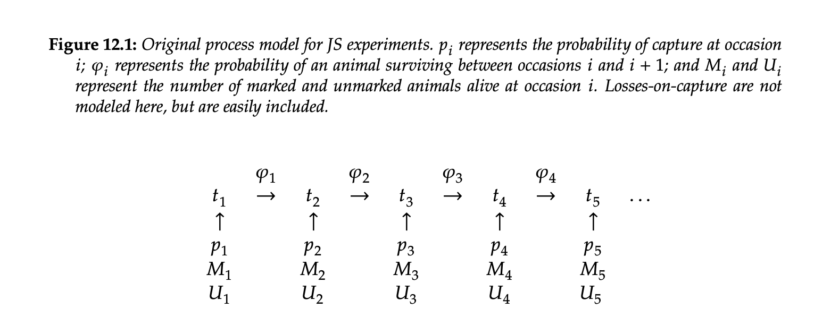
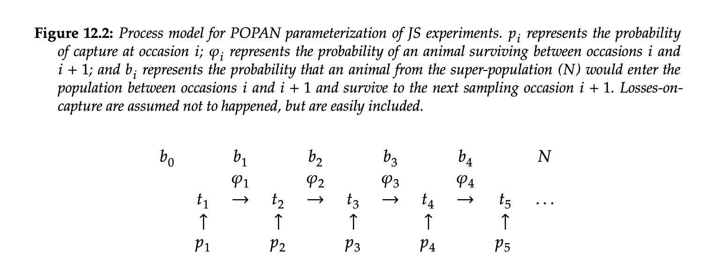

```{r setup, include = FALSE}
options(htmltools.dir.version = FALSE)
knitr::opts_chunk$set(echo = FALSE, fig.align = 'center', warning=FALSE, message=FALSE,fig.retina = 2)
library(WILD8370)
library(nimble)
library(MCMCvis)
library(ggforce)
source(here::here("R/zzz.R"))
# library(gganimate)
```
## Readings

> Analysis of Capture-Recapture Data By Rachel S. McCrea, Byron J. T. Morgan


> Kéry & Schaub Chapter 10


> http://www.phidot.org/software/mark/docs/book/pdf/chap12.pdf

---
## Review

Lots of parameters of potential interest in these models

- $\phi$ = probability of survival 

- $\gamma$ = biologically meaningless parameter indicating if you are 'removed' from the available population 

- $N_t$ = realized abundance in time $t$

- $N_s$ = total number of individuals ever alive (superpopulation)

- $B_t$ = realized recruits in time $t$

- $b_t$ = probability of being recruited in time $t$ given that you ARE recruited at some point from time $t = 1$ to time $t = T$ (semi-meaningless biologically)

- $\psi$ = proportion of the total augmented population (real + imaginary) that are real

- $f = \frac{B_t}{N_t}$ = per capita realized recruitment 

---
## JS Open Population Model 

In the classic Jolly-Seber formulation, the population followed this structure:

```{r out.width = "75%"}

```

Here, what the authors call $M_t$ is just marked individuals, so $M_t$ + $U_t$ = $N_t$.
---
## POPAN Style Superpopulation Model 

First published by Schwarz et al. (1993) and then Schwarz and Arnason (1996). The model was run using a software package called "POPAN", hence we now call it the "POPAN model". 

This formulation was much more ground-breaking before we had data augmentation techniques.

```{r out.width = "75%"}

```

---
## POPAN Style Superpopulation Model 

As mentioned, this formulation has very little impact when we actually go to code the model in Nimble. 

<br/>

In our Bayesian framework, $N_s$ = $\psi*M$ (proportion of total augmented population ever alive).

<br/>

Then at each time set, animals can enter the population with some probability $b$, such that the expected value of recruits in each time step is just $N_s*b$ = $\psi*M*b$. 

<br/>

Assuming you are using data augmentation and the robust design, the only difference is that animals can be alive (z = 1) but not real. This has some implications for MCMC mixing but no biological difference. 

---
## POPAN Model in Nimble
```{css, echo = F}
.smaller .remark-code { 
font-size: 85% !important;
}
```

.smaller[
```{r, eval = F, echo = T}
for (i in 1:M){
    w[i] ~ dbern(psi)   # Draw latent inclusion
    z[i,1] ~ dbern(nu[1])
    # Observation process
    mu1[i] <- p[i,1] * z[i,1] * w[i]
    y[i,1] ~ dbern(mu1[i])
    # Subsequent occasions
    for (t in 2:n.occasions){
       # State process
       q[i,t-1] <- 1-z[i,t-1]
       mu2[i,t] <- phi[i,t-1] * z[i,t-1] + nu[t] * prod(q[i,1:(t-1)])
       z[i,t] ~ dbern(mu2[i,t])
       # Observation process
       mu3[i,t] <- z[i,t] * p[i,t] * w[i]
       y[i,t] ~ dbern(mu3[i,t])
    } #t
 } #i
for(t in 1:n.occasions){
  nu[t] ~ dbeta(1,1)
}
```
] 

---
## Pros and Cons - General 

####Regardless of parameterization, fully time-dependent models are hard 

In a fully time-dependent model (both $p$ and $\phi$ vary with time) 
<br/>

    + Cannot separately estimate first entry probability and first capture probability 
    
<br/>
    
    + Cannot separately estimate last surival and last capture probability without robust design
    


---
## Other Models Exist


  + Pradel Model (reverse-time formulation)
  
  <br/>
  
  + Link-Barker Model (allows for direct prior on per-capita fecundity)
  
  <br/>
  
  + Multi-state Formulation
  
  <br/>
  
--
<br/>

All these model requires a lot of data on marked individuals - we need a lot of data to understand complex processes

---
## Example open population - Dipper!

As promised, this would not be a wildlife Bayesian statistics class without learning about the Dipper dataset. 


European Dipper (*Cinclus cinclus*) were captured annually from 1981--1987. This dataset was originally analyzed in a CJS format and later in POPAN. It has be analyzed excessively since its original publication. 


Consider this a history lesson :) 


We will use the version of this data contained in the `bayess` package 


```{r, echo = T}
library(bayess)
data("eurodip")
```

---
## Dippers 

In eurodip, each row corresponds to a capture-recapture story for a given adult dipper, 0 indicating an absence of capture that year and, in the case of a capture, 1, 2, or 3 representing the zone where the dipper is captured.

We will first analyze this data using the per-capita restricted dynamic occupancy form of the JS model and then as a multi-state model that explicitly accounts for location. 


```{r, echo = T}
head(eurodip)
```


