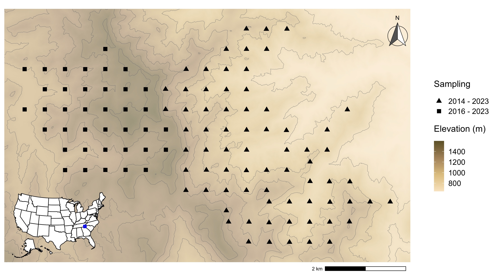

```{r setup, include = FALSE}
options(htmltools.dir.version = FALSE)
knitr::opts_chunk$set(echo = FALSE, fig.align = 'center', warning=FALSE, message=FALSE,fig.retina = 2)
library(WILD8370)
library(nimble)
library(MCMCvis)
library(ggforce)
library(ggplot2)
library(nimbleEcology)
source(here::here("R/zzz.R"))
# library(gganimate)
```
## Readings

> 


> Devarajan, K., Morelli, T.L. and Tenan, S. (2020), Multi-species occupancy models: review, roadmap, and recommendations. Ecography, 43: 1612-1624. https://doi.org/10.1111/ecog.04957

> 

---
## Multi-Species Occupancy Models

Like single species occupancy models, MSOMs are built on the encounter histories of species across sites in a region during repeated visits


Based on the concept that a community is an ensemble of species occurring at a site and a metacommunity is the collection of such communities


Typically used to estimate species richness at both the community and metacommunity level


---
## Conceptual Framework from Guillera-Arroita et al 2019

```{r out.width = "65%"}
knitr::include_graphics("figs/c1.png")
```

---
## Conceptual Framework from Guillera-Arroita et al 2019

```{r out.width = "65%"}

```

---
## Conceptual Framework from Guillera-Arroita et al 2019

```{r out.width = "65%"}
knitr::include_graphics("figs/c3.png")
```

---
## Assumptions and their reprocussions


#### Geographic and demographic closure  


#### Independence


#### Accurate identification


#### Ecological similarity in species


---
## Assumptions and their reprocussions

#### Geographic and demographic closure  

  +  Sites represent closed populations; No births, deaths, colonization or extinction during the surveys
  
  
        +   Violations usually inflate species richness 
  
---
## Assumptions and their reprocussions

#### Independence

  + Detection and occupancy probability at site A is independent of detection and occupancy at site B 
  
  + Frequently violated when there is oversampling or clustered sampling 
  
  + Spatial correlations usually not a problem
  
  + Luckily, violations can be tested for statistically! 
  
    
      + Violations lead to overestimate of precision of estimates 
      
  
---
## Assumptions and their reprocussions

#### Accurate identification

  + We assume observers can correctly separate species from one another 
  
  + Easily violated during any auditory surveys (frogs, insects, birds, etc.)

  
    + Fluctuations in detectability or observer error can significantly impact and bias occupancy estimates
    
    + False positives result in an overestimation of species richness
    
    + Can partially address by modeling false positives if misidentification and 
      detection probabilities are caused by different processes
    
    
---
## Assumptions and their reprocussions

#### Ecological similarity in species

  + Assume that species in the community are similar, resulting in species-specific random effects that are drawn from the same distribution


    + Violating this assumption leads to prediction errors (just straight up wrong answers)
    
    
---
## Basic Mathematical Structure

$x_i$ that is 1 for real specie and 0 for fake species with probability $\omega$:

$$x_i \sim Bernoulli(\omega)$$

Occupancy status of each species $i$ at each site $j$:

$$z_{i,j} \sim Bernoulli(x_i \psi_i)$$

$$logit(\psi_{i,j}) \sim Normal(\mu_{\psi}, \sigma^2_{\psi})$$

$$y_{i,j} \sim Binomial(z_{i,j}p_i, K)$$

$p_i$ is a species-specific random effect:

$$logit(p_i) \sim Normal(\mu_{p}, \sigma_{p}^2)$$

---
## Basic Mathematical Structure

Richness at each site:

$$\Large R_j = \sum_{i=1}^M z_{i,j}$$

Richness overall:

$$\Large R = \sum_{i=1}^M x_{i}$$


**Note: Even with model assumptions perfectly met, estimation of the total number of species can be poor if many species are missed (>15%)**


---
## False Positives 


```{r out.width = "75%"}
knitr::include_graphics("figs/FPs.png")
```

False positives are easier to deal with when we only have one species because we don't have to identify who the false detection 'belongs to'. 

Without extra data, you cannot reliably model false positives in a multi-species framework. 

Table stolen from: 

Miller, D.A., Nichols, J.D., McClintock, B.T., Grant, E.H.C., Bailey, L.L. and Weir, L.A. (2011), Improving occupancy estimation when two types of observational error occur: non-detection and species misidentification. Ecology, 92: 1422-1428. https://doi.org/10.1890/10-1396.1

---
## Multispecies Occupancy in Nimble

```{r, eval = F, echo = T}
nimbleCode({
   # Superpopulation process
   for (k in 1:M){
     w[k] ~ dbern(omega) # Community membership indicator
   }
   
   # Ecological model for latent occurrence z (process model)
   for (k in 1:M){
    # Priors to describe heterogeneity among species in community
     logit(psi[k]) <- lpsi[k] #present/absent prob
     lpsi[k] ~ dnorm(mu.lpsi, sd = sd.lpsi) #present/absent on normal scale
     lp[k] ~ dnorm(mu.lp, sd = sd.lp) #detection on normal scale
     for (i in 1:nsite) {
       z[i,k] ~ dbern(w[k] * psi[k]) #gotta be real to be present
     }
   }
```

---
## Multispecies Occupancy in Nimble

```{r, eval = F, echo = T}
   # Observation model for observed detection frequencies
   for (k in 1:M){
     logit(p[k]) <- lp[k]
     for (i in 1:nsite) {
       y[i,k] ~ dbin(z[i,k] * p[k], ntrials[i])
     }
   }
   
   # Hyperpriors to describe full community
   omega ~ dunif(0,1) # For data augmentation (probability of community membership)
   mu.lpsi ~ dnorm(0,sd = 30) # Community mean of occupancy (logit)
   mu.lp ~ dnorm(0,sd = 30) # Community mean of detection (logit)
   sd.lpsi ~ dunif(0,5) # Species heterogeneity in logit(psi)
   sd.lp ~ dunif(0,5) # Species heterogeneity in logit(p)
```

---
## Multispecies Occupancy in Nimble

```{r, eval = F, echo = T}
   # Derived quantities
   for (k in 1:M){
     Socc.fs[k] <- sum(z[1:nsite,k]) # Number of occupied sites among the sampled ones
     speciesP[k]<-(Socc.fs[k]>0)*1
   }
   
   Nsmall<-sum(speciesP[1:M]) #total species present
   for (i in 1:nsite) {
     Nsite[i] <- sum(z[i,1:M]) # Number of occurring species at each site
   }
   Ntotal <- sum(w[1:M]) # Total metacommunity size
})
```

---
## Example - Blantant Self Promotion 

```{r out.width = "75%"}
knitr::include_graphics("figs/me.png")
```

---
## Example - Southern Appalachian Birds

This study was conducted across an elevation gradient and 10 years. The original study also used abundance. We'll just analyze occupancy in 2018.

```{r out.width = "75%"}

```

---
## Example - Southern Appalachian Birds

The data for this example are located in the WILD8370 package, or you can find them online where the paper is published. 


