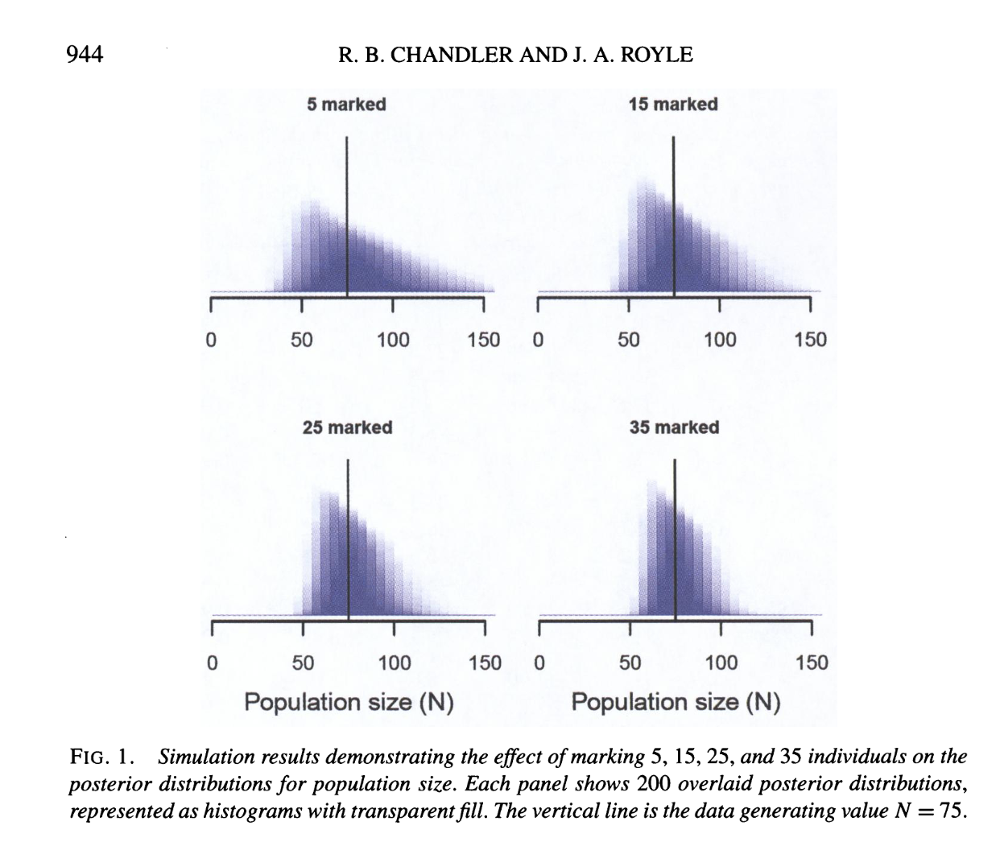

```{r setup, include = FALSE}
options(htmltools.dir.version = FALSE)
knitr::opts_chunk$set(echo = FALSE, fig.align = 'center', warning=FALSE, message=FALSE,fig.retina = 2)
library(WILD8370)
library(nimble)
library(MCMCvis)
library(ggforce)
library(ggplot2)
library(nimbleEcology)
source(here::here("R/zzz.R"))
# library(gganimate)
```
## Readings

> Chandler, Richard B., and J. Andrew Royle. “Spatially explicit models for inference about density in unmarked or partially marked populations." The Annals of Applied Statistics 7, no. 2 (2013): 936–54. http://www.jstor.org/stable/23566419.

> Augustine, B. C., J. A. Royle, S. M. Murphy, R. B. Chandler, J. J. Cox, and M. J. Kelly. 2019. Spatial capture–recapture for categorically marked populations with an application to genetic capture–recapture. Ecosphere 10(4):e02627. 10.1002/ecs2.2627

> Chandler, R. B., D. A. Crawford, E. P. Garrison, K. V. Miller, and M. J. Cherry. 2022. Modeling abundance, distribution, movement, and space use with camera and telemetry data. Ecology 103(10): e3583. 10.1002/ecy.3583

> Catherine Sun, Joanna M. Burgar, Jason T. Fisher, A. Cole Burton,
A cautionary tale comparing spatial count and partial identity models for estimating densities of threatened and unmarked populations. Global Ecology and Conservation. Volume 38, 2022. e02268. https://doi.org/10.1016/j.gecco.2022.e02268.

---
## Spatial Capture Recapture 

 - Goal is to estimate the density of a population across some pre-determined region 
 
 
 - Typically done by setting out an array of detectors and identifying all captured individuals with unique IDs 
 
 
 - Statistical process hinges on the concept that animals with activity centers farther from traps will be harder to detect than those nearby 
 
 
---
## Spatial Capture Recapture 

Basic SCR:

$$\Lambda = \int_{\mathcal{S}} \lambda(s)$$


$$\large \mathbf{s_{i}} \sim Uniform(s_{min}, s_{max})$$

$$\Large z_{i} \sim Bernoulli(\frac{\Lambda}{M})$$

$$\large p_{ij} = g_0*e^{(-\|s_i - x_j\|^2/(2\sigma^2))}$$

$$\large y_{ij} \sim Binomial(z_i*p_{ij}, K)$$

$$\Large N = \sum^M_{i=1} z_i$$

---
## Capture Probability 

In classical SCR we think of detection probability as a function of distance between the activity center and our trap, defined with a half-normal:

$$\large p_{ij} = g_0*e^{(-\|s_i - x_j\|^2/(2\sigma^2))}$$

<br/>

This tells us the probability of trap $j$ detecting individual $i$ specifically. This is great when we have marked data.
 
<br/>

For unmarked SCR, however, we would rather know the probability that trap $j$ detects *ANY* individual. 

<br/>

That is, what is $P(At Least One)$ for a binomial ?


---
## Binomial and Poisson

Turns out the binomial and the Poisson distribution are connected! 


In fact, the Poisson distribution is actually a limiting case of a Binomial distribution when the number of trials, $n$, gets very large and $p$, the probability of success, is small. 


This is excellent news, because we know:

$$\Large P(Pois(\lambda) = 0) = e^{-\lambda}$$

Which means the probability of drawing a non-0 number from a poisson is just:

$$\Large  P(At Least One) = 1-e^{-\lambda}$$


---
## Binomial and Poisson

Okay, so now we know about the Poisson but how does that help with us with the binomial? 


Remember if:

$$\Large N \sim Pois(\lambda)$$

Then 

$$\Large E(N) = \lambda$$ 


And if:


$$\Large N \sim Binomial(n, p)$$

Then 


$$\Large E(N) = n*p$$ 

---
## Binomial and Poisson

Thus we can approximate the probability that a trap detects at least one individual with

$$\Large  P(At Least One) = 1-e^{-np}$$

<br/>

In practice, this means we need to calculate:

$$\Large 1 - e^{-(\sum_{i = 1}^M p_{i,j}*z_i)}$$

---
## Unmarked SCR Model

$$\Lambda = \int_{\mathcal{S}} \lambda(s)$$


$$\large \mathbf{s_{i}} \sim Uniform(s_{min}, s_{max})$$

$$\Large z_{i} \sim Bernoulli(\frac{\Lambda}{M})$$

$$\large p_{ij} = g_0*e^{(-\|s_i - x_j\|^2/(2\sigma^2))}$$

$$\large y_{j} \sim Binomial(1 - e^{-(\sum_{i = 1}^M p_{i,j}*z_i)}, K)$$

$$\Large N = \sum^M_{i=1} z_i$$

---
## What is an occasion?

We are back to working in discrete time, which means we need to define occasions. 


In physical capture/tagging studies, this is usually defined by the trapping process. 


For cameras or ARUs, this gets trickier. 


There are no clear answers here. Just try to make an informed decision based on your species. 


- insert shrugging emoji here - 


---
## In Nimble - Homogenous Version

```{r, echo = T}
uscr <- nimbleCode({
g0 ~ dbeta(1, 1)       ## Baseline capture probability
sigma ~ dexp(1)  ## Scale parameter of encounter function
psi ~ dbeta(1, 1)  ## Data augmentation parameter
for(i in 1:M) {
  s[i,1] ~ dunif(xlim[1], xlim[2]) ## x-coord of activity center
  s[i,2] ~ dunif(ylim[1], ylim[2]) ## y-coord of activity center
  z[i] ~ dbern(psi)                ## Is individual real?
  for(j in 1:J) {
    dist[i,j] <- sqrt((s[i,1]-x[j,1])^2 + (s[i,2]-x[j,2])^2)
    p[i,j] <- g0*exp(-dist[i,j]^2/(2*sigma^2))
  }
} #end M
  for(j in 1:J) {
    y[j] ~ dbinom(p = 1-exp(-(sum(z[1:M]*p[1:M,j]))), size = ntrials) ## Model per trap
  }
EN <- M*psi  ## Expected value of N
N <- sum(z[1:M])  ## Realized value of N
})
```

---
## Simulation

Let's simulate some data to prove to ourselves that this works. 


```{css, echo = F}
.smaller .remark-code { 
font-size: 65% !important;
}
```

.smaller[
```{r, echo = T}
set.seed(35)
N <- 55
max <- 20
min <- 0
g0 <-  .75
sig <- 1
x <- seq(3, 17, length.out = 14) #14 x 14
traps <- expand.grid(x,x) #camera traps
ntrials <- 14 #2 weeks
ntraps <- nrow(traps)
s <- matrix(runif(N*2, min = min, max = max), ncol = 2)
dist <- p  <- array(NA, c(N, ntraps))
seen <- array(NA, c(N, ntraps, ntrials))
for(j in 1:ntraps) {
  for(i in 1:N){
    dist[i,j] <- sqrt((s[i,1]-traps[j,1])^2 + (s[i,2]-traps[j,2])^2)
    p[i,j] <- g0*exp(-dist[i,j]^2/(2*sig^2))
    for(k in 1:ntrials){
    seen[i,j,k] <- rbinom(1, 1, p[i,j]) ## actual captures
    }
  }
}
```
]

---
## Simulation

Our data:

```{r, echo = T}
plot(s, pch = 19, ylim = c(min, max), xlim = c(min, max))
points(traps, cex = 1, pch = 4, col = 'red')
```

---
## Simulation

Since we don't know which individual is which, we will turn our 'captures' of each individual into a sum indicating how many days (of 14) each trap saw at least one animal.

```{r, echo = T}
pertrap <- apply(seen, MARGIN = c(2,3), FUN = function(x)sum(x))
binary <- (pertrap > 1)*1
y2 <- rowSums(binary)
y2
```

---
## Simulation

Great, now we can send our information to nimble

```{r, echo = T}
M <- N*2 #for convenience
nd <- list(y = y2)
nc <- list(M = M, J = ntraps, ntrials = ntrials, 
           xlim = c(min, max), ylim = c(min, max),
           x = traps)
s.init <- rbind(s, s)
ni <- list(g0 = runif(1), 
           sigma = sig,
           psi = N/M,
           s = s.init,
           z = c(rep(1, N), rep(0, M-N)))
params <- c('EN', 'N', 'psi', 'g0', 'sigma')
```

---
## Simulation

```{r, echo = T, eval = T}
prepnim <- nimbleModel(code = uscr, constants = nc,
                           data = nd, inits = ni, calculate = T)
prepnim$initializeInfo() #will tell you what is or isn't initialized
prepnim$calculate() #if this is NA or -Inf you know it's gone wrong
```

---
## Simulation

```{r, echo = T, eval = F}
library(parallel)
cl <- makeCluster(3) #each chain will be run separately 
clusterExport(cl = cl, varlist = c("ni",  "nc", 'nd', "uscr", 'params'))
uscr1 <- clusterEvalQ(cl = cl,{
library(nimble) #reload packages for each core
library(coda)
prepnim <- nimbleModel(code = uscr, constants = nc,
                           data = nd, inits = ni, calculate = T)
prepnim$initializeInfo() #will tell you what is or isn't initialized
prepnim$calculate() #if this is NA or -Inf you know it's gone wrong
mcmcnim <- configureMCMC(prepnim, monitors = params, print = T)
nimMCMC <- buildMCMC(mcmcnim) #actually build the code for those samplers
Cmodel <- compileNimble(prepnim) #compiling the model itself in C++;
Compnim <- compileNimble(nimMCMC, project = prepnim) # compile the samplers next
Compnim$run(niter = 5000, nburnin = 3000, thin = 1)
res <- (as.mcmc(as.matrix(Compnim$mvSamples)))
return(res)
}) #this will take awhile and not produce any progress bar
uscr1 <- as.mcmc.list(uscr1)
stopCluster(cl)
```

```{r}
uscr1 <- readRDS('uscr1.rds')
```

---
## Simulation


```{r, echo = T,fig.width=8, fig.height=5}
MCMCvis::MCMCtrace(uscr1, params = c('g0', 'sigma'), pdf = F)
```

---
## General Notes


- As with marked spatial capture recapture, the ratio of trap spacing to $\sigma$ can strongly influence your results


- Even a small amount of prior information about $g0$ or $\sigma$ makes a big difference 


- $g0$ and $\sigma$ are always going to co-vary (not truly independent)


---
## Add in Marked Individuals

In lab we will discuss how to combine camera data with collar data to ensure accurate unmarked SCR estimates


```{r out.width = "55%"}

```


