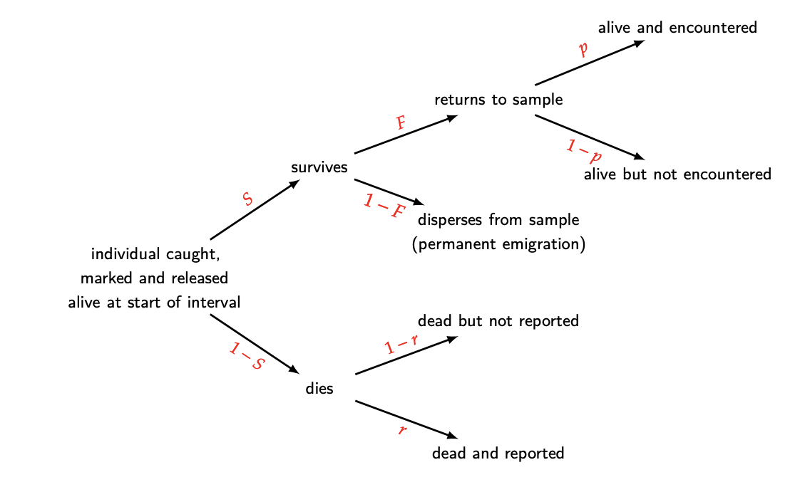
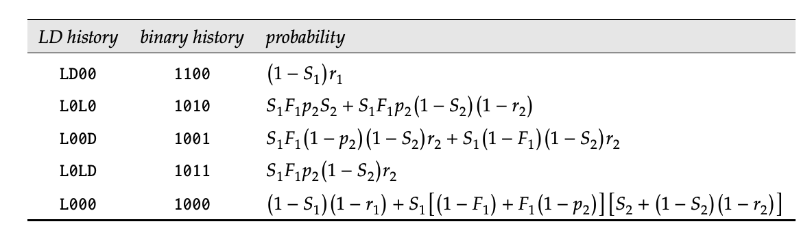

```{r, include = FALSE}
knitr::opts_chunk$set(
   warning = FALSE, message = FALSE,
   fig.align = 'center', fig.retina = 2,
  fig.height=8, fig.width=8,
  echo = TRUE,
  collapse = TRUE,
  comment = "#>"
)
library(dplyr)
library(knitr)
library(ggplot2)
source(here::here("R/zzz.R"))
```

```{r setup, echo=FALSE}
library(WILD8370)
library(nimble)
library(coda)
library(mcmcOutput)
library(MCMCvis)
library(terra)
```

Today's lab will focus on joint live-dead recovery models. These can be written as a multi-state model or marginalized for faster analysis in a hidden markov model framework. 

## Joint live-dead recovery models

In the world of game-species, there is often a reward for hunters who report any tags or bands they find on their harvested prey. Not every animal that is tagged will be reported, either because hunters poach the animal or because the animal dies from some other method besides human-induced mortality. In the non-game world, these models are often used in situations where dead animals are sometimes found incidentally when surveying for live animals (such as finding a marked tortoise shell while surveying gopher tortoises).  

The following graphic from the phidot.org MARK handbook does a great job of explaining the general idea. 

```{r out.width = "75%"}

```

From this diagram, we can easily establish the likelihood of any capture/encounter history (again, stealing this from the MARK handbook). Below is the likelihood for a 2-occasion study. 

```{r out.width = "75%"}

```

## Example - Snow Goose Data

Today's data comes from an 18-year data set on the lesser snow goose (*Anser caerulescens caerulescens*). 18,493 adult female geese were captured from 1997 to 2014, during their flightless phase in Nunavut, Canada. The citation for the paper containing this data can be found here:

Weegman MD, Wilson S, Alisauskas RT, Kellett DK. Assessing bias in demographic estimates from joint live and dead encounter models. PeerJ. 2020 Jun 23;8:e9382. doi: 10.7717/peerj.9382. PMID: 32612891; PMCID: PMC7319022.


The geese could be observed in 1 of 3 states:

1 = alive in the study area

2 = recovered dead 

3 = not seen


For the sake of this lab, we will only be using a subset of the data from the first 10 years.

```{r}
library(WILD8370)
#data(snowgeese)
head(snowgeese)
```

## Model 

We would like to code the model so that geese can be in 5 possible true states:

1 = Pre-alive

2 = alive in the study area 

3 = alive and **permanently** emigrated

4 = recently dead **and** recovered (notice this state inherently includes detection of the death)

5 = recently dead, but not recovered, or dead for more than 1 time period (absorbing)

We will treat $\phi$, $p$, and $gam$ as time-varying.  $\phi$ and $p$,will be modeled as logit-link with an intercept and a random effect of year. 

### Transition Matrix

We will build the model in sections, starting with the transition matrix. 

```{r, echo =T, eval = F}
for(t in 1:nocc){
  gamma[1,1,t] <- 1-gam[t]            # Pr(pre alive t -> pre alive t+1)
  gamma[1,2,t] <- gam[t]              # Pr(pre alive t -> alive and here t+1)
  gamma[1,3,t] <- 0                   # Pr(pre alive t -> alive but gone t+1)
  gamma[1,4,t] <- 0                   # Pr(pre alive t -> recent dead and recovered t+1)
  gamma[1,5,t] <- 0                   # Pr(pre alive t -> absorbing dead t+1)
  
  gamma[2,1,t] <- 0                   # Pr(alive t -> pre-alive t+1)
  gamma[2,2,t] <- phi[t]*f            # Pr(alive t -> alive and here t+1)
  gamma[2,3,t] <- phi[t]*(1-f)        # Pr(alive t -> alive but gone t+1)
  gamma[2,4,t] <- (1-phi[t])*r        # Pr(alive t -> recent dead and recovered t+1)
  gamma[2,5,t] <- (1-phi[t])*(1-r)    # Pr(alive t -> absorbing dead t+1)
  
  gamma[3,1,t] <- 0                   # Pr(alive but gone t -> pre-alive t+1)
  gamma[3,2,t] <- 0                   # Pr(alive but gone t -> alive and here t+1)
  gamma[3,3,t] <- phi[t]              # Pr(alive but gone t -> alive but gone t+1)
  gamma[3,4,t] <- (1-phi[t])*r        # Pr(alive but gone t -> recent dead and recovered t+1)
  gamma[3,5,t] <- (1-phi[t])*(1-r)    # Pr(alive but gone t -> absorbing dead t+1)
  
  gamma[4,1,t] <- 0                   # Pr(Recently dead t -> pre-alive t+1)
  gamma[4,2,t] <- 0                   # Pr(Recently dead t -> alive and here t+1)
  gamma[4,3,t] <- 0                   # Pr(Recently dead t -> alive but gone t+1)
  gamma[4,4,t] <- 0                   # Pr(Recently dead t -> recent dead and recovered t+1)
  gamma[4,5,t] <- 1                   # Pr(Recently dead t -> absorbing dead t+1)
  
  gamma[5,1,t] <- 0                   # Pr(absorbing dead t -> pre-alive t+1)
  gamma[5,2,t] <- 0                   # Pr(absorbing dead t -> alive and here t+1)
  gamma[5,3,t] <- 0                   # Pr(absorbing dead t -> alive but gone t+1)
  gamma[5,4,t] <- 0                   # Pr(absorbing dead t -> recent dead and recovered t+1)
  gamma[5,5,t] <- 1                   # Pr(absorbing dead t -> absorbing dead t+1)
  
```


### Observation Matrix

Next let's make the observation matrix. This is a 5 X 3 matrix since we can only observe geese in 3 possible states (alive, dead, not observed). 

```{r, echo = T, eval = F}
  omega[1,1,t] <- 0           # Pr(pre alive t and detected as alive)
  omega[2,1,t] <- p[t]        # Pr(alive and here t and detected as alive)
  omega[3,1,t] <- 0           # Pr(alive and gone t and detected as alive)
  omega[4,1,t] <- 0           # Pr(recent dead and recovered t and detected as alive)
  omega[5,1,t] <- 0           # Pr(absorbing dead t and detected as alive)
  
  omega[1,2,t] <- 0           # Pr(pre alive t and recovered dead)
  omega[2,2,t] <- 0           # Pr(alive and here t and recovered dead)
  omega[3,2,t] <- 0           # Pr(alive and gone t and recovered dead)
  omega[4,2,t] <- 1           # Pr(recent dead and recovered t and recovered dead)
  omega[5,2,t] <- 0           # Pr(absorbing dead t and recovered dead)
  
  omega[1,3,t] <- 1           # Pr(pre alive t and not observed)
  omega[2,3,t] <- 1-p[t]      # Pr(alive and here t and not observed)
  omega[3,3,t] <- 1           # Pr(alive and gone t and not observed)
  omega[4,3,t] <- 0           # Pr(recent dead and recovered t and not observed)
  omega[5,3,t] <- 1           # Pr(absorbing dead t and not observed)
  
  
```

### Initial Matrix and Priors

Let's get the initial probability of each state and then add in our priors. Rather than writing out a dbeta prior for each delta, I'm just going to use a dirichlet prior, which will ensure all the resulting probabilities sum to 1. The dirichlet can be thought of as a multinomial but for probabilities. 

```{r, eval = F, echo = T}
  delta[1:5] ~ ddirch(alphas[1:5])

for(t in 1:nocc){
  logit(p[t]) <- mu.p + eps.p[t] #detection
  logit(phi[t]) <- mu.phi + eps.phi[t] #survival
  eps.p[t] ~ dnorm(0, sd = sd.p)
  eps.phi[t] ~ dnorm(0, sd = sd.phi)
  gam[t] ~ dbeta(1,1) #removal from augmented population
}

r ~ dbeta(1, 1) #recovery probability
f ~ dbeta(1, 1) #fidelity probability
sd.phi ~ dexp(1)
sd.p ~ dexp(1)

```

### Full Model

```{r, echo =T, eval = T}
livedeadHMM <- nimbleCode({
for(t in 1:nocc){
  gamma[1,1,t] <- 1-gam[t]            # Pr(pre alive t -> pre alive t+1)
  gamma[1,2,t] <- gam[t]              # Pr(pre alive t -> alive and here t+1)
  gamma[1,3,t] <- 0                   # Pr(pre alive t -> alive but gone t+1)
  gamma[1,4,t] <- 0                   # Pr(pre alive t -> recent dead and recovered t+1)
  gamma[1,5,t] <- 0                   # Pr(pre alive t -> absorbing dead t+1)
  
  gamma[2,1,t] <- 0                   # Pr(alive t -> pre-alive t+1)
  gamma[2,2,t] <- phi[t]*f            # Pr(alive t -> alive and here t+1)
  gamma[2,3,t] <- phi[t]*(1-f)        # Pr(alive t -> alive but gone t+1)
  gamma[2,4,t] <- (1-phi[t])*r        # Pr(alive t -> recent dead and recovered t+1)
  gamma[2,5,t] <- (1-phi[t])*(1-r)    # Pr(alive t -> absorbing dead t+1)
  
  gamma[3,1,t] <- 0                   # Pr(alive but gone t -> pre-alive t+1)
  gamma[3,2,t] <- 0                   # Pr(alive but gone t -> alive and here t+1)
  gamma[3,3,t] <- phi[t]              # Pr(alive but gone t -> alive but gone t+1)
  gamma[3,4,t] <- (1-phi[t])*r        # Pr(alive but gone t -> recent dead and recovered t+1)
  gamma[3,5,t] <- (1-phi[t])*(1-r)    # Pr(alive but gone t -> absorbing dead t+1)
  
  gamma[4,1,t] <- 0                   # Pr(Recently dead t -> pre-alive t+1)
  gamma[4,2,t] <- 0                   # Pr(Recently dead t -> alive and here t+1)
  gamma[4,3,t] <- 0                   # Pr(Recently dead t -> alive but gone t+1)
  gamma[4,4,t] <- 0                   # Pr(Recently dead t -> recent dead and recovered t+1)
  gamma[4,5,t] <- 1                   # Pr(Recently dead t -> absorbing dead t+1)
  
  gamma[5,1,t] <- 0                   # Pr(absorbing dead t -> pre-alive t+1)
  gamma[5,2,t] <- 0                   # Pr(absorbing dead t -> alive and here t+1)
  gamma[5,3,t] <- 0                   # Pr(absorbing dead t -> alive but gone t+1)
  gamma[5,4,t] <- 0                   # Pr(absorbing dead t -> recent dead and recovered t+1)
  gamma[5,5,t] <- 1                   # Pr(absorbing dead t -> absorbing dead t+1)
  
  omega[1,1,t] <- 0                   # Pr(pre alive t and detected as alive)
  omega[2,1,t] <- p[t]                # Pr(alive and here t and detected as alive)
  omega[3,1,t] <- 0                   # Pr(alive and gone t and detected as alive)
  omega[4,1,t] <- 0                   # Pr(recent dead and recovered t and detected as alive)
  omega[5,1,t] <- 0                   # Pr(absorbing dead t and detected as alive)
  
  omega[1,2,t] <- 0                   # Pr(pre alive t and recovered dead)
  omega[2,2,t] <- 0                   # Pr(alive and here t and recovered dead)
  omega[3,2,t] <- 0                   # Pr(alive and gone t and recovered dead)
  omega[4,2,t] <- 1                   # Pr(recent dead and recovered t and recovered dead)
  omega[5,2,t] <- 0                   # Pr(absorbing dead t and recovered dead)
  
  omega[1,3,t] <- 1                   # Pr(pre alive t and not observed)
  omega[2,3,t] <- 1-p[t]              # Pr(alive and here t and not observed)
  omega[3,3,t] <- 1                   # Pr(alive and gone t and not observed)
  omega[4,3,t] <- 0                   # Pr(recent dead and recovered t and not observed)
  omega[5,3,t] <- 1                   # Pr(absorbing dead t and not observed)

  logit(p[t]) <- mu.p + eps.p[t] #detection
  logit(phi[t]) <- mu.phi + eps.phi[t] #survival
  eps.p[t] ~ dnorm(0, sd = sd.p)
  eps.phi[t] ~ dnorm(0, sd = sd.phi)
  gam[t] ~ dbeta(1,1) #removal from augmented population
} #end t

delta[1:5] ~ ddirch(alphas[1:5])
r ~ dbeta(1, 1) #recovery probability
f ~ dbeta(1, 1) #fidelity probability
sd.phi ~ dexp(1)
sd.p ~ dexp(1)
mu.p ~ dnorm(0, 1)
mu.phi ~ dnorm(0, 1)

for(i in 1:M){
    y[i,1:nocc] ~ dDHMMo(init =  delta[1:5],
                         probObs = omega[1:5, 1:3, 1:nocc],
                         probTrans = gamma[1:5, 1:5, 1:(nocc-1)],
                         len = nocc,
                         checkRowSums = 1)
  } #end M
})
```  

## Analysis

Time to make some nimble objects. 

```{r}
M <- nrow(snowgeese)*2
nocc <- ncol(snowgeese)
y <- as.matrix(snowgeese)
nind <- nrow(snowgeese)
y <- rbind(y, array(3, c(M-nind, nocc))) 
```

```{r}
nd <- list(y = y)
nc <- list(M = M, nocc = nocc, alphas = rep(1, 5))
ni <- list(eps.p = rep(0, nocc),
           eps.phi = rep(0, nocc),
           sd.phi = rexp(1),
           sd.p = rexp(1),
           mu.p = rnorm(1),
           mu.phi = rnorm(1),
           r = rbeta(1,1,1),
           f = rbeta(1,1,1),
           gam = rbeta(nocc, 1,1),
           delta = rdirch(1, rep(1, 5))
)
  
params <- c('mu.p', 'eps.p', 'sd.p', 'mu.phi', 'eps.phi', 'sd.phi', 'gam',  'delta', 'r', 'f', 'phi', 'p')
```

Check that the model is correctly setup. 

```{r, echo = T, warning = F}
prepnim <- nimbleModel(code = livedeadHMM, constants = nc,
                           data = nd, inits = ni, calculate = T)
prepnim$initializeInfo()
prepnim$calculate()
```

This step may take several minutes (it's a big model!)

```{r, echo = T, eval = F}
library(parallel)
library(coda)
cl <- makeCluster(3) #each chain will be run separately 
clusterExport(cl = cl, varlist = c("ni",  "nc", 'nd', "livedeadHMM", 'params'))
geese <- clusterEvalQ(cl = cl,{
library(nimble) #reload packages for each core
library(coda)
library(nimbleEcology)
prepnim <- nimbleModel(code = livedeadHMM, constants = nc,
                           data = nd, inits = ni, calculate = T)
prepnim$initializeInfo() #will tell you what is or isn't initialized
prepnim$calculate() #if this is NA or -Inf you know it's gone wrong
mcmcnim <- configureMCMC(prepnim, monitors = params, print = T)
nimMCMC <- buildMCMC(mcmcnim) #actually build the code for those samplers
Cmodel <- compileNimble(prepnim) #compiling the model itself in C++;
Compnim <- compileNimble(nimMCMC, project = prepnim) # compile the samplers next
Compnim$run(niter = 5000, nburnin = 1000, thin = 1)
res <- (as.mcmc(as.matrix(Compnim$mvSamples)))
return(res)
}) #this will take awhile and not produce any progress bar
geese <- as.mcmc.list(geese)
stopCluster(cl)
```

## Output

Time to inspect the chains

```{r}
MCMCvis::MCMCtrace(geese, pdf = F, Rhat = T, n.eff = T)
```

## Homework

1. Using the data from the joint live-dead recovery model we ran above, run a hidden markov model that does *not* allow for dead recovery. In the data, if animals are recovered dead, treat them as unobserved in that time period. Graphically compare your estimates of $\phi$ and $N$ with those estimated in the lab above. How does including the dead recoveries impact your results? 
 
2. Using the dipper data we used in class, run a hidden markov model that accounts for location of capture in the state process. Instead of the 3 states we had in class (pre-alive, alive, dead), you should now have 5 states (pre-alive, alive at site 1, alive at site 2, alive at site 3, and dead). You should have 4 observation states (seen at site 1, seen at site 2, seen at site 3, and not seen). Keep phi constant between sites, but allow p to vary by site. Make a graph showing the estimated population at each site over time. 

3.  On a 1-10 scale, with 1 being the worst week ever and 10 being the best, how would you rate this week's content? What lingering questions/confusion about the lecture or lab do you still have?
