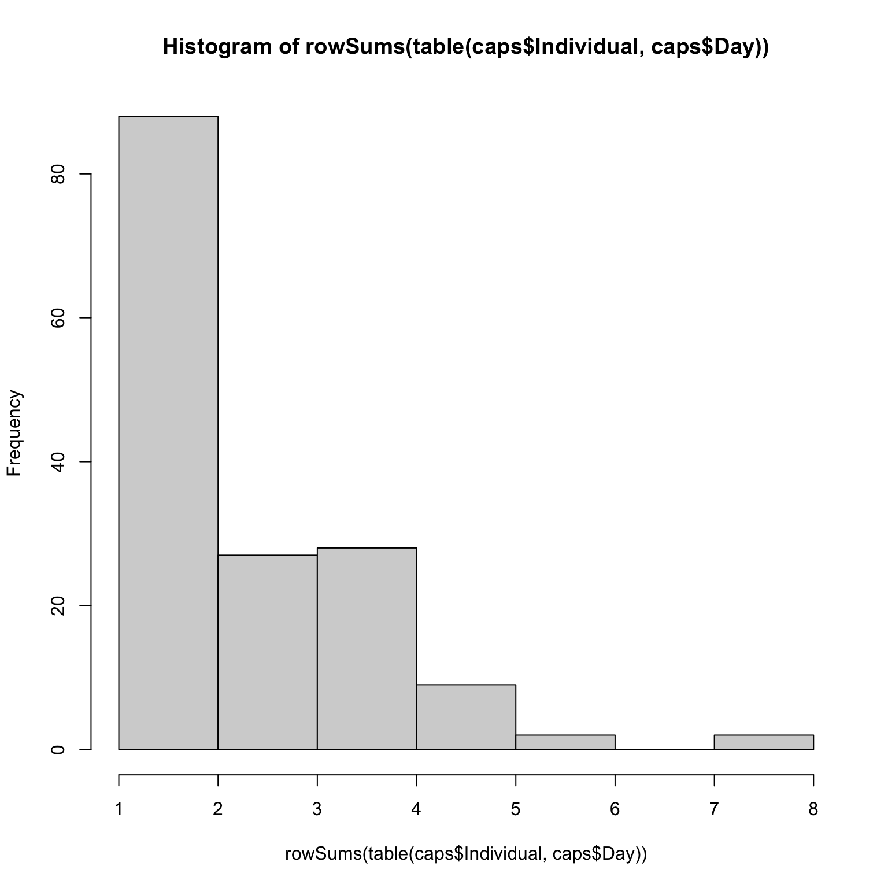
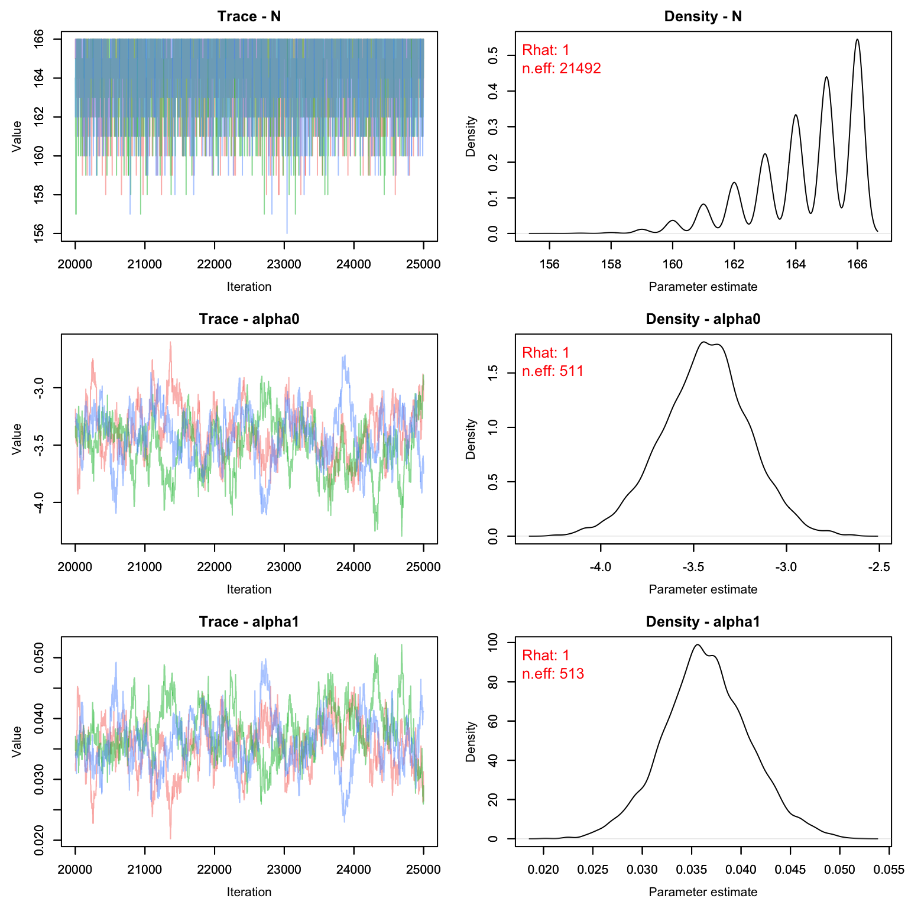
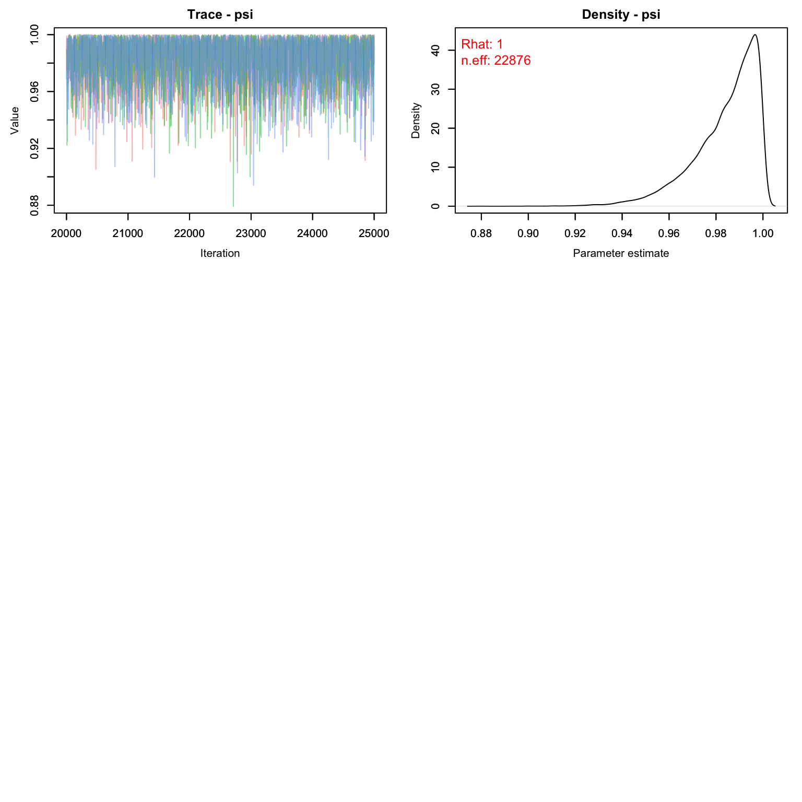
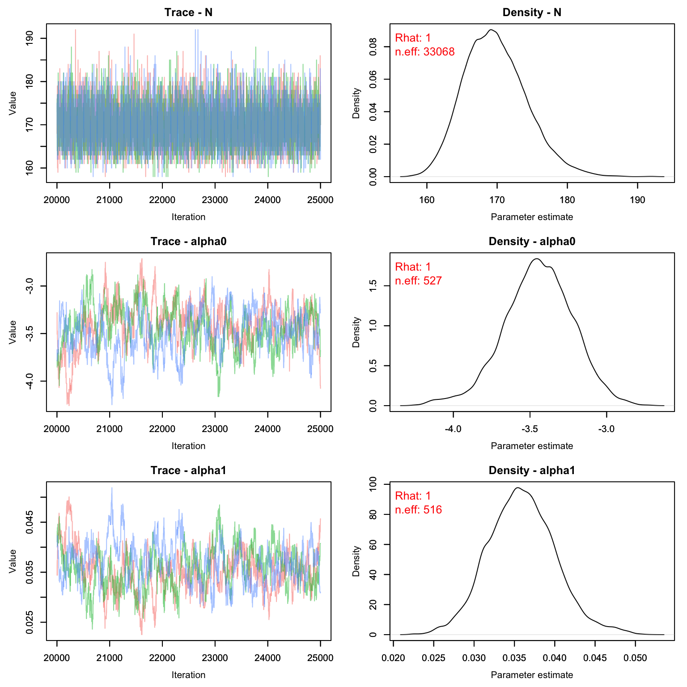
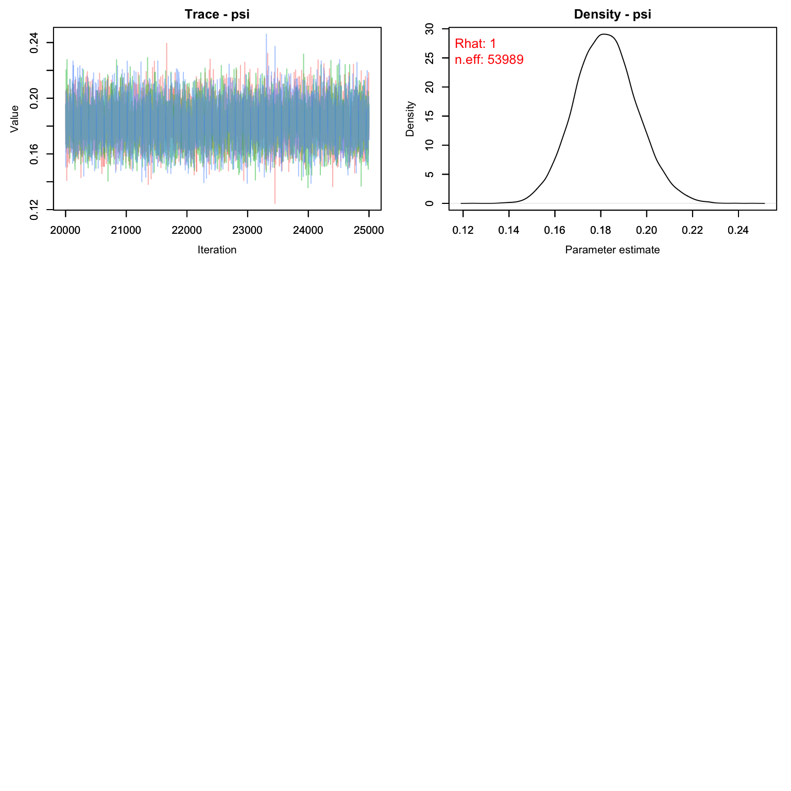
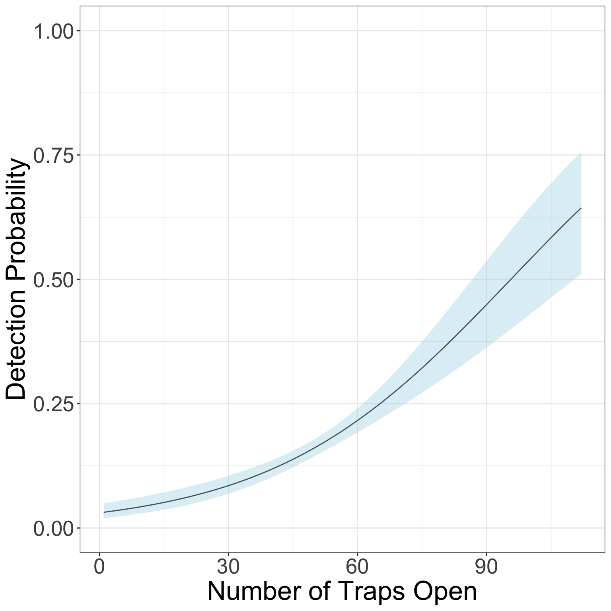
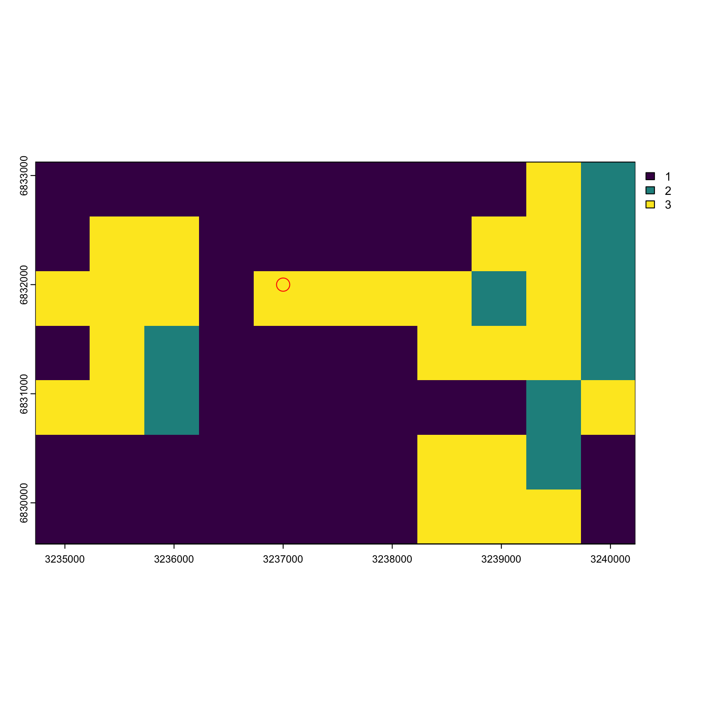
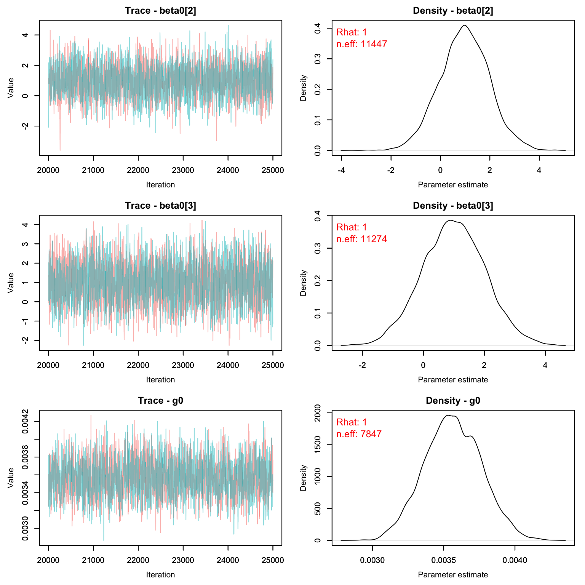
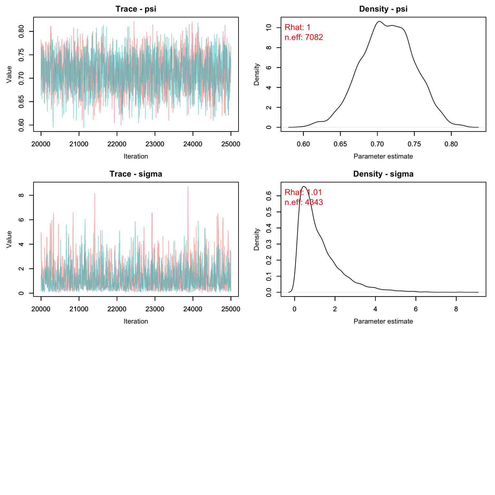

In this activity we'll practice running both a spatial and non-spatial mark recapture model on some data. 


## Butterflies!

Today's dataset is on a study of false heath fritillary butterflies (*Melitaea diamina*) conducted in Finland. You can find more details about this study here:

Fabritius, H., Rönkä, K. & Ovaskainen, O. The dual role of rivers in facilitating or hindering movements of the false heath fritillary butterfly. Mov Ecol 3, 4 (2015). https://doi.org/10.1186/s40462-015-0031-z

The full study uses three datasets but today we will be only using the data from 1995. 

**In case the authors read this and wonder what the heck we are teaching American students, I have modified the habitat information to be simpler than the original study. So the results will be slightly off from the original study.

From the authors:

Details of the three data sets summarized below. The number of search days without (with) parenthesis indicates the length of study period (versus the number of effective search days with search activity).

+ Location: Siitama, Pirkanmaa, Finland (61.6°N, 24.2°E)
+ Year of data collection: 1995
+ Coordinator: Niklas Wahlberg
+ Coordinate reference system: Finland Zone 3 (EPSG:2393)

We will work with 4 files to get the information we need:

1. Effort log - a 1/0 matrix indicating if the 'trap' was operational 
2. Records of each time an individual was captured (and what trap)
3. Trap locations in Finland Zone 3 units 
4. Habitat information about the trapping area


## Summary Info

Let's see how many individuals we have and what our effort looks like:


``` r
data('butterflies')

```


``` r
effort <- Finnish_butterflies$effort
str(effort)
#> 'data.frame':	112 obs. of  15 variables:
#>  $ Trap: int  1 2 3 4 5 6 7 8 9 10 ...
#>  $ V1  : int  1 1 0 0 0 1 1 1 0 0 ...
#>  $ V2  : int  1 1 1 1 0 1 1 1 1 0 ...
#>  $ V3  : int  0 0 0 0 0 0 0 0 1 0 ...
#>  $ V4  : int  0 0 0 0 0 1 0 1 1 1 ...
#>  $ V5  : int  1 1 1 1 1 1 0 1 1 1 ...
#>  $ V6  : int  0 0 0 1 1 1 0 1 0 0 ...
#>  $ V7  : int  0 0 0 0 1 1 0 1 1 1 ...
#>  $ V8  : int  1 0 1 1 1 1 0 1 0 0 ...
#>  $ V9  : int  0 0 1 0 1 1 0 1 0 0 ...
#>  $ V10 : int  0 0 0 0 1 1 0 1 0 1 ...
#>  $ V11 : int  0 0 0 0 1 1 0 1 0 0 ...
#>  $ V12 : int  0 0 0 0 1 1 0 1 0 0 ...
#>  $ V13 : int  0 0 0 0 1 1 0 1 0 0 ...
#>  $ V14 : int  0 0 0 0 1 1 0 1 0 0 ...
```
There appear to be 14 trap occasions and 112 traps. 


``` r
caps <- as.data.frame(Finnish_butterflies$cap_hist)
head(caps)
#>   Individual Day Trap Sex
#> 1          1  10   72   0
#> 2          1   2   72   1
#> 3          1   3   72   1
#> 4          1   4   72   1
#> 5          1   6   72   1
#> 6          1   1   74   0
```
The data gives us one row per capture. The individual ID is given for each capture, as well as the day, and trap of this capture. We also have some indication of sex (as a binary variable). 


``` r
hist(rowSums(table(caps$Individual, caps$Day)))
```


Most individuals were only captured once, but a few individuals were capture up to 8 times!

## Non-Spatial CMR

Let's begin by analyzing the data in a non-spatial framework. We know that sometimes not all areas were surveyed, so we'll model detection probability as a function of the number of traps that were open.


``` r
cmr_flies <- nimbleCode({
  psi ~ dbeta(1, 1) #N/M
  alpha0 ~ dnorm(0, 1)
  alpha1 ~ dnorm(0, 1)
  for(t in 1:nocc){
    logit(p[t]) <- alpha0 + alpha1*effort[t]
  }
  
  for(i in 1:M){
    z[i] ~ dbern(psi)
    
    for(t in 1:nocc){
      y[i, t] ~ dbern(p[t] * z[i])
    } # end t
  } # end i
  
  N <- sum(z[1:M])
  EN <- M*psi
})
```

We can start by putting our capture data into a different format. We want one row per individual, one column per occasion. We also need to choose a value of $M$. Our goal is simply to choose a value of M such that $N/M < 1$. Of course, we don't *know* $N$, so this is tricky. 

Let's start by choosing a value that will likely be too small so we can see what happens. I'll choose $M$ = `nind` + 10, which would suggest we only missed 10 butterflies in the entire population when sampling.


``` r
nind <- length(unique(caps$Individual))
nocc <- 14
M <- nind + 10 
y <- array(0, c(M, nocc)) 
```
Note that I create an array that has $M$ rows, not $nind$ rows. This is because we need to tell the model the capture history of EVERY individual that could potentially be in the population, including the ones we never saw.


``` r
for(i in 1:nrow(caps)){
  y[caps$Individual[i],caps$Day[i]] <- 1
}
head(y)
#>      [,1] [,2] [,3] [,4] [,5] [,6] [,7] [,8] [,9] [,10] [,11] [,12] [,13] [,14]
#> [1,]    1    1    1    1    0    1    0    0    0     1     0     0     0     0
#> [2,]    1    0    0    0    1    1    0    0    0     0     0     0     0     0
#> [3,]    1    0    0    0    0    0    0    1    0     0     0     0     0     0
#> [4,]    1    0    0    0    1    1    0    0    0     0     0     0     0     0
#> [5,]    0    1    0    1    0    0    0    0    0     0     0     0     0     0
#> [6,]    0    1    0    1    1    1    0    0    0     0     0     0     0     0
tail(y)
#>        [,1] [,2] [,3] [,4] [,5] [,6] [,7] [,8] [,9] [,10] [,11] [,12] [,13]
#> [161,]    0    0    0    0    0    0    0    0    0     0     0     0     0
#> [162,]    0    0    0    0    0    0    0    0    0     0     0     0     0
#> [163,]    0    0    0    0    0    0    0    0    0     0     0     0     0
#> [164,]    0    0    0    0    0    0    0    0    0     0     0     0     0
#> [165,]    0    0    0    0    0    0    0    0    0     0     0     0     0
#> [166,]    0    0    0    0    0    0    0    0    0     0     0     0     0
#>        [,14]
#> [161,]     0
#> [162,]     0
#> [163,]     0
#> [164,]     0
#> [165,]     0
#> [166,]     0
```
Next we can cleanup effort, which will tell the model the number of traps open per occasion. 


``` r
head(effort)
#>   Trap V1 V2 V3 V4 V5 V6 V7 V8 V9 V10 V11 V12 V13 V14
#> 1    1  1  1  0  0  1  0  0  1  0   0   0   0   0   0
#> 2    2  1  1  0  0  1  0  0  0  0   0   0   0   0   0
#> 3    3  0  1  0  0  1  0  0  1  1   0   0   0   0   0
#> 4    4  0  1  0  0  1  1  0  1  0   0   0   0   0   0
#> 5    5  0  0  0  0  1  1  1  1  1   1   1   1   1   1
#> 6    6  1  1  0  1  1  1  1  1  1   1   1   1   1   1
eff <- colSums(effort[,-1]) 
```

Above, we're taking the column sums, which will give us a count of how many traps were open. Notice that column 1 is trap ID, so we don't add that one up for our effort vector. 

#### First Try CMR 

Now let's make our objects and run the model!

``` r
nc <- list(effort = eff,nocc = nocc, M = M)
nd <- list(y = y)
z.init <- c(rep(1, nind), rep(0, M-nind))
ni <- list(psi = sum(z.init)/M, alpha0 = rnorm(1), alpha1 = rnorm(1), z = z.init)
params <- c('alpha0', 'alpha1', 'psi', 'N')
```

We'll start with the long way of running the model look for problems with initial values:

``` r
prepnim <- nimbleModel(code = cmr_flies, constants = nc,
                           data = nd, inits = ni, calculate = T)
prepnim$initializeInfo() #will tell you what is or isn't initialized
prepnim$calculate() #if this is NA or -Inf you know it's gone wrong
#> [1] -Inf
```
Uh oh! Let's figure out what went wrong. 


``` r
sum(prepnim$logProb_z)
#> [1] -37.79
```

Nothing wrong with the z values. Is y the problem?


``` r
sum(prepnim$logProb_y)
#> [1] -Inf
```

Yes! The log probability is -Inf. That's not great. 

Individual 1 seems to have issues:

``` r
prepnim$logProb_y[1,]
#>  [1]  0.000e+00  0.000e+00 -9.359e-09  0.000e+00       -Inf  0.000e+00
#>  [7]       -Inf       -Inf       -Inf  0.000e+00       -Inf       -Inf
#> [13]       -Inf       -Inf
```


``` r
prepnim$y[1,]
#>  [1] 1 1 1 1 0 1 0 0 0 1 0 0 0 0
```

Hmm, it doesn't like when we didn't see it. What did we initialize p as? 


``` r
prepnim$p
#>  [1] 1 1 1 1 1 1 1 1 1 1 1 1 1 1
```

Oops! We told the model our detection probability was way too high! Let's try again with lower values:


``` r
ni <- list(psi = sum(z.init)/M, alpha0 = rnorm(1), 
           alpha1 = 0, z = z.init)
```


``` r
prepnim <- nimbleModel(code = cmr_flies, constants = nc,
                           data = nd, inits = ni, calculate = T)
prepnim$initializeInfo() #will tell you what is or isn't initialized
prepnim$calculate() #if this is NA or -Inf you know it's gone wrong
#> [1] -1326
```
Much better. We can now run the model. 

#### Second Try CMR 

``` r
library(parallel)
cl <- makeCluster(3) #each chain will be run separately 
clusterExport(cl = cl, varlist = c("ni",  "nc", 'nd', "cmr_flies", 'params'))
cmr1 <- clusterEvalQ(cl = cl,{
library(nimble) #reload packages for each core
library(coda)
prepnim <- nimbleModel(code = cmr_flies, constants = nc,
                           data = nd, inits = ni, calculate = T)
prepnim$initializeInfo() #will tell you what is or isn't initialized
prepnim$calculate() #if this is NA or -Inf you know it's gone wrong
mcmcnim <- configureMCMC(prepnim, monitors = params, print = T)
nimMCMC <- buildMCMC(mcmcnim) #actually build the code for those samplers
Cmodel <- compileNimble(prepnim) #compiling the model itself in C++;
Compnim <- compileNimble(nimMCMC, project = prepnim) # compile the samplers next
Compnim$run(niter = 50000, nburnin = 25000, thin = 1)
res <- (as.mcmc(as.matrix(Compnim$mvSamples)))
return(res)
}) #this will take awhile and not produce any progress bar
cmr1 <- as.mcmc.list(cmr1)
stopCluster(cl)
```


Let's see what our model output gives us.

``` r
MCMCvis::MCMCtrace(cmr1, pdf = F, Rhat = T, n.eff = T)
```



Uh oh! Our value for $M$ is clearly way too low. The posterior for $psi$ is pushing up against 1, which means we've enforced a total population that is lower than the number the data is suggesting. Let's try again with a higher M. 

One way to choose a value of M is to look at the raw detection frequency:


``` r
mean(rowSums(table(caps$Individual, caps$Day)))
#> [1] 2.628
```

On average, we saw each butterfly 2.6 times, despite going out for 14 days. That tells us that a good starting M might be about $nind * 14/2.6$ which is ~ $nind*5.4$


``` r
M <- nind*6
y <- array(0, c(M, nocc))
for(i in 1:nrow(caps)){
    y[caps$Individual[i],caps$Day[i]] <- 1
}
nc <- list(effort = eff,nocc = nocc, M = M)
nd <- list(y = y)
z.init <- c(rep(1, nind), rep(0, M-nind))
ni <- list(psi = sum(z.init)/M, alpha0 = rnorm(1), alpha1 = 0, z = z.init)
```

#### Third Try CMR 


``` r
library(parallel)
cl <- makeCluster(3) #each chain will be run separately 
clusterExport(cl = cl, varlist = c("ni",  "nc", 'nd', "cmr_flies", 'params'))
cmr2 <- clusterEvalQ(cl = cl,{
library(nimble) #reload packages for each core
library(coda)
prepnim <- nimbleModel(code = cmr_flies, constants = nc,
                           data = nd, inits = ni, calculate = T)
prepnim$initializeInfo() #will tell you what is or isn't initialized
prepnim$calculate() #if this is NA or -Inf you know it's gone wrong
mcmcnim <- configureMCMC(prepnim, monitors = params, print = T)
nimMCMC <- buildMCMC(mcmcnim) #actually build the code for those samplers
Cmodel <- compileNimble(prepnim) #compiling the model itself in C++;
Compnim <- compileNimble(nimMCMC, project = prepnim) # compile the samplers next
Compnim$run(niter = 50000, nburnin = 25000, thin = 1)
res <- (as.mcmc(as.matrix(Compnim$mvSamples)))
return(res)
}) #this will take awhile and not produce any progress bar
cmr2 <- as.mcmc.list(cmr2)
stopCluster(cl)
```


Let's see what our model output gives us.

``` r
MCMCvis::MCMCtrace(cmr2, pdf = F, Rhat = T, n.eff = T)
```



Much better! We can see that this time our M was large enough - only about 18% of the M individuals were probably even real. The fact that we chose an M that was too large doesn't matter, but it does slow down our model runs a little bit. Remember that biologically, $psi$ means nothing. If we were to run this again, we could drop the value of M down by a few hundred and still get the same result with less computer time. 


``` r
MCMCsummary(cmr2)
#>             mean       sd      2.5%       50%     97.5% Rhat n.eff
#> N      169.66491 4.437504 162.00000 169.00000 179.00000    1 33068
#> alpha0  -3.46048 0.237253  -3.93749  -3.45911  -2.97955    1   527
#> alpha1   0.03619 0.004392   0.02728   0.03615   0.04498    1   516
#> psi      0.18199 0.013482   0.15643   0.18173   0.20910    1 53989
```

### Graphing Detection Probability 

Before we move on, let's graph how detection probability is expected to increase with increasing effort (traps open). 

Remember that our equation for detection is:

``` r
logit(p[t]) <- alpha0 + alpha1*effort[t]
```

We can replicate that with R code and our MCMC chains to get a CI for detection over different levels of effort. We'll first create a vector with all the possible values of effort we want to plot along, and then use the equation above to estimate the value of p for each level of effort using each iteration of the MCMC. Then we'll take the quantiles of those estimates to get the CI of the posterior. 


``` r
alphas <- as.matrix(cmr2[,c('alpha0', 'alpha1'),])
effort_seq <- 1:112 
niter <- nrow(alphas)
p_out <- array(NA, c(niter, length(effort_seq)))
for(j in 1:niter){
  p_out[j,] <- plogis(alphas[j,'alpha0'] + alphas[j,'alpha1']*effort_seq)
}
p.CI <- apply(p_out, 2, FUN = function(x){quantile(x, c(0.025, .5, .975))})
```

Time to graph! 


``` r
gg.p <- data.frame(effort = effort_seq,
                   LCI = p.CI[1,],
                   UCI = p.CI[3,],
                   Median = p.CI[2,])
library(ggplot2)
ggplot(gg.p, aes(x = effort, y = Median))+
  geom_line()+
  geom_ribbon(aes(ymin = LCI, ymax = UCI), alpha = .4, fill = 'lightblue')+
  theme_bw()+
  ylim(0, 1)+
  ylab("Detection Probability")+
  xlab("Number of Traps Open")+
  theme(axis.text = element_text(size = 20), axis.title = element_text(size = 25))
```



## Spatial Capture Recapture 

Now that we've analyzed the data in a non-spatial manner, let's try fitting the data to a spatial model.  

There are 3 types of habitat designated by the authors:
- Low quality matrix (habitat type 1)
- High quality matrix (habitat type 3)
- Breeding area (habitat 2)

It's likely that butterfly abundance is different in each of these habitat types. We'll want to include that in our model for lambda. 


``` r
scr_flies <- nimbleCode({
for(j in 1:3){
  beta0[j] ~ dnorm(1, 1) 
}
g0 ~ dunif(0, 1)
sigma ~ dgamma(1, 1)

for(g in 1:G) { ## Loop over pixels
  lambda[g] <- exp(beta0[habitat[g]])*pixelArea
  pi[g] <- lambda[g]/SumLambda
}
SumLambda <- sum(lambda[1:G])
psi <- SumLambda/M #proportion real

for(i in 1:M) {
  s[i,1] ~ dunif(xlim[1], xlim[2]) 
  s[i,2] ~ dunif(ylim[1], ylim[2])
  pixel[i] <- lookup[round((ylim[2]-s[i,2])/delta+0.5),  ## raster row
                     round((s[i,1]-xlim[1])/delta+0.5)]  ## raster column
  logProb[i] <- log(pi[pixel[i]])
  zeros[i] ~ dpois(-logProb[i]) ## zeros trick for IPP
  z[i] ~ dbern(psi)
  for(j in 1:ntraps) {
    dist[i,j] <- sqrt((s[i,1]-x[j,1])^2 + (s[i,2]-x[j,2])^2)
    p[i,j] <- g0*exp(-dist[i,j]^2/(2*sigma^2))
  }
}
for(i in 1:M) {  ## Model for capture histories
  for(j in 1:ntraps) {
    for(t in 1:nocc){
      y[i,j,t] ~ dbern(p[i,j]*z[i]*effort[j,t])
    }
  }
}

EN <- M*psi
N <- sum(z[1:M])
})
```

In the spatial model, there's a little more data cleanup than before. One part we haven't dealt with before is the lookup table and the habitat. Let's take a look at our habitat information. 

### Pixel Lookup

``` r
habitat <- Finnish_butterflies$habitat
habitat_sp <- terra::rast(habitat, type = 'xyz', crs = 'EPSG:2393')
plot(habitat_sp)
```


We can see that most of the habitat is low-quality (type 3) with some high quality (type 3) and breeding area (type 2) mixed in here and there. 

If we were to look at the habitat information as a vector, it would look like:


``` r
c(habitat$layer)
#>  [1] 1 1 1 1 1 1 1 1 1 3 2 1 3 3 1 1 1 1 1 3 3 2 3 3 3 1 3 3 3 3 2 3 2 1 3 2 1 1
#> [39] 1 1 3 3 3 2 3 3 2 1 1 1 1 1 1 2 3 1 1 1 1 1 1 1 3 3 2 1 1 1 1 1 1 1 1 3 3 3
#> [77] 1
```

The order of the pixels goes from the top left pixel to the top right, then down one row starting on the left and going across again, etc. until we end at the bottom right pixel. 


``` r
dim(habitat_sp)
#> [1]  7 11  1
pixel_order <- matrix(1:prod(dim(habitat_sp)), byrow = T, ncol = dim(habitat_sp)[2])
pixel_order
#>      [,1] [,2] [,3] [,4] [,5] [,6] [,7] [,8] [,9] [,10] [,11]
#> [1,]    1    2    3    4    5    6    7    8    9    10    11
#> [2,]   12   13   14   15   16   17   18   19   20    21    22
#> [3,]   23   24   25   26   27   28   29   30   31    32    33
#> [4,]   34   35   36   37   38   39   40   41   42    43    44
#> [5,]   45   46   47   48   49   50   51   52   53    54    55
#> [6,]   56   57   58   59   60   61   62   63   64    65    66
#> [7,]   67   68   69   70   71   72   73   74   75    76    77
```

Therefore making our habitat object for Nimble is really easy:

``` r
hab <- c(habitat$layer)
```

Let's say I had a point with coordinates c(3237000, 6832000). How do I figure out what pixel I'm in? First I need the pixel resolution of my raster and the minimum and maximum values of my state space. Then I can subtract each point by its the limit value and divide by the width of my pixel to find where I am. 


``` r
myx <- 3237000/1e5
myy <- 6832000/1e5
res(habitat_sp)/1e5
#> [1] 0.005 0.005
lims <- unname(as.vector(ext(habitat_sp)))/1e5
lims
#> [1] 32.35 32.40 68.30 68.33
```

Our habitat resolution is 500 by 500 m. 


``` r
c(round((lims[4] - myy)/.005+.5), round((myx - lims[1])/.005+.5))
#> [1] 3 5
```
Our point is in the pixel 5th from the left and 3rds from the top. 


``` r
pixel_order[3,5]
#> [1] 27
```
Our point is in pixel 27! 


``` r
plot(habitat_sp)
points(3237000, 6832000, pch = 21, col = 'red', cex = 2)
```


We will need to implement this sort of system inside our model so it can lookup which pixel any given point is in and use that habitat covariate in the log likelihood. 

### Gathering Information for Nimble

Time to get our information in order for Nimble. 

First constants

``` r
npix = length(hab)
pixelArea = prod(res(habitat_sp)/1e5)
M = nind*1.5
traps <- Finnish_butterflies$traps
trap_locs <- traps[,c('x', 'y')]/1e5
nconsts <- list(G = npix, pixelArea = pixelArea, habitat = hab, M = M, xlim = lims[1:2], 
                ylim = lims[3:4], delta = .005, x = as.matrix(trap_locs), 
                effort = as.matrix(effort[,-1]), ntraps = nrow(traps),
                nocc = nocc)
```

Then data. We have three types of data:
    + the all 0's to trick the model isn't using the point process to distribute points 
    + the observations we have of butterflies, which should be in an array of dimension M by ntraps by occasion
    + The lookup table, which isn't actually data but nimble doesn't like it as a constants for whatever reason

``` r
zeros <- array(0, M)
y <- array(0, c(M, nrow(traps), nocc))
for(i in 1:nrow(caps)){
  me <- caps$Individual[i]
  day <- caps$Day[i]
  trap <- caps$Trap[i]
  y[me, trap, day] <- 1

}

ndat <- list(y = y, zeros = zeros, lookup = pixel_order)
```

Finally, initial values. 


``` r
ninits <- list(beta0 = rnorm(3,1,1), g0 = runif(1), sigma = runif(1, 3, 5)) #give a big sigma
z.init <- c(rep(1, nind), rep(0, M-nind))
s.init <- array(NA, c(M, 2))
for(i in 1:M){
  mytraps <- which(rowSums(y[i,,]) >0)
  if(length(mytraps) >0 ){ #guys we saw
    s.init[i, ] <- colMeans(trap_locs[mytraps, ])
  } else { #augmented guys
    s.init[i, 1] <- runif(1, lims[1], lims[2]) #x coord 
    s.init[i, 2] <- runif(1, lims[3], lims[4]) #y coord
  }
}
ninits$z <- z.init
ninits$s <- s.init
```

Also parameters of interest:

``` r
prms <- c('beta0', 'g0', 'sigma', 'N', 'EN', 'psi')
```

Time to see if the initial values are working! 

### Running the SCR Model
*Note, this model will take a decent amount of time to run.  


``` r
library(parallel)
cl <- makeCluster(2) #each chain will be run separately 
clusterExport(cl = cl, varlist = c("ninits",  "nconsts", 'ndat', "scr_flies", 'prms'))
scr1 <- clusterEvalQ(cl = cl,{
library(nimble) #reload packages for each core
library(coda)
prepnim <- nimbleModel(code = scr_flies, constants = nconsts,
                           data = ndat, inits = ninits, calculate = T)
prepnim$initializeInfo() #will tell you what is or isn't initialized
prepnim$calculate() #if this is NA or -Inf you know it's gone wrong
mcmcnim <- configureMCMC(prepnim, monitors = prms, print = T)
nimMCMC <- buildMCMC(mcmcnim) #actually build the code for those samplers
Cmodel <- compileNimble(prepnim) #compiling the model itself in C++;
Compnim <- compileNimble(nimMCMC, project = prepnim) # compile the samplers next
Compnim$run(niter = 50000, nburnin = 25000, thin = 1)
res <- (as.mcmc(as.matrix(Compnim$mvSamples)))
return(res)
}) #this will take awhile and not produce any progress bar
scr1 <- as.mcmc.list(scr1)
stopCluster(cl)
```


Time to plot:

``` r
MCMCvis::MCMCtrace(scr1, pdf = F, Rhat = T, n.eff = T)
```



Exact estimates can be summarized as well (but remember sigma needs to be multiplied by 1e5)


``` r
MCMCsummary(scr1)
#>               mean        sd       2.5%       50%     97.5% Rhat n.eff
#> EN       1.668e+02 8.4416561 150.386066 1.669e+02 1.834e+02 1.00  7082
#> N        1.706e+02 4.5663976 163.000000 1.700e+02 1.800e+02 1.00  9965
#> beta0[1] 1.195e+01 0.0507878  11.848617 1.195e+01 1.205e+01 1.00  7098
#> beta0[2] 1.001e+00 1.0062739  -0.965923 1.004e+00 3.000e+00 1.00 11447
#> beta0[3] 9.927e-01 1.0112792  -1.006757 9.886e-01 2.977e+00 1.00 11274
#> g0       3.576e-03 0.0002033   0.003192 3.573e-03 3.982e-03 1.00  7847
#> psi      7.130e-01 0.0360755   0.642675 7.131e-01 7.837e-01 1.00  7082
#> sigma    1.186e+00 1.0453899   0.146388 8.694e-01 3.935e+00 1.01  4343
```
Let's compare with the CMR method:


``` r
CMR_est <- MCMCsummary(cmr2, params = 'N')
SCR_est <- MCMCsummary(scr1, params = 'N')
rbind(CMR_est, SCR_est)
#>     mean    sd 2.5% 50% 97.5% Rhat n.eff
#> N  169.7 4.438  162 169   179    1 33068
#> N1 170.6 4.566  163 170   180    1  9965
```


## Homework

1. In lab (above), we used the Mt version for our closed CMR model (detection probability changed with time). Perform a prior predictive check on this model. Report out the posterior for p in each occasion. If you notice any are very informative, adjust the alpha values until the posteriors look reasonable. 

2. Re-write the closed CMR model as an Mb model (trap shyness). Compare the abundance estimates with those we got out of the Mt version of the model by graphing the CIs (and medians) for both models. 

3. In the SCR model, our detection probability predicts that male and female butterflies are equally likely to be captured. Re-write the model to allow for male and female butterflies to have different detection probabilities. You can adjust either g0 or sigma. You do not need to run this model, just write out the code. 

4. Using the SCR beta outputs from lab (not the one you just wrote for Q3), make a map showing the expected abundance in each pixel in the study area as well as the trap locations. Notice that the model predicts very high abundance in the poor quality habitat. Why do you think that is? (Note: this is an inaccurate model, clearly but *why*?)

5.  On a 1-10 scale, with 1 being the worst week ever and 10 being the best, how would you rate this week's content? What lingering questions/confusion about the lecture or lab do you still have?
